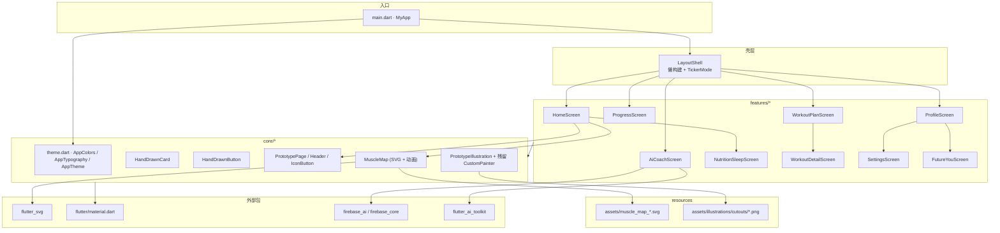
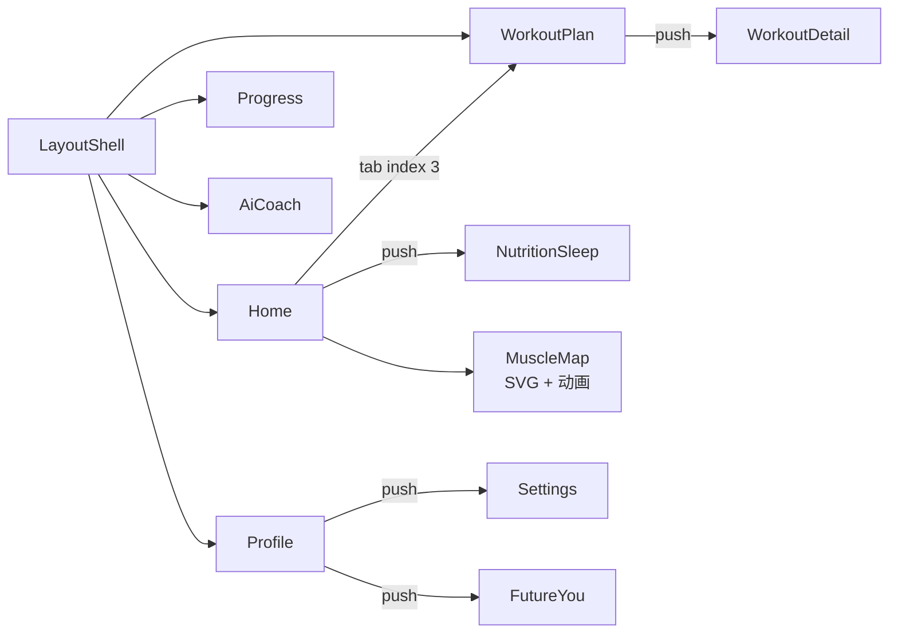

# Logic-of-Hashira / fitness_log_app — Code Wiki

> 本文档基于仓库当前源码自动生成，描述 **Fitness Record App**（Flutter 健身记录 UI 原型）的整体架构、模块职责、关键 API 与运行方式。  
> 包名：`fitness_log_app` · 应用 ID：`com.hashira.logic.fitness_log_app` · 版本：`1.0.0+1`

---

## 目录

1. [项目概览](#1-项目概览)
2. [技术栈与依赖](#2-技术栈与依赖)
3. [整体架构](#3-整体架构)
4. [目录结构](#4-目录结构)
5. [导航与页面流](#5-导航与页面流)
6. [核心层（core）](#6-核心层core)
7. [功能模块（features）](#7-功能模块features)
8. [数据与状态管理](#8-数据与状态管理)
9. [平台工程与资源](#9-平台工程与资源)
10. [运行与构建](#10-运行与构建)
11. [测试](#11-测试)
12. [Trellis 开发工作流](#12-trellis-开发工作流)
13. [已知限制与演进方向](#13-已知限制与演进方向)
14. [附录：图标类型一览](#14-附录图标类型一览)

---

## 1. 项目概览

| 项 | 说明 |
|---|---|
| **定位** | 手绘 / 原型（Prototype）风格的健身生活方式 App **前端 UI 原型** |
| **核心能力（当前）** | 首页 6 习惯入口 + Muscle Map 周训练热力图、AI 教练聊天（Firebase AI Gemini）、7 天周训练计划、营养 / 睡眠、个人资料与设置、Future You |
| **后端** | 无业务 API；Coach 使用 Firebase AI Logic（Gemini `gemini-2.5-flash`） |
| **状态管理** | 无全局方案（无 Provider/Riverpod/Bloc）；各 `StatefulWidget` 本地 `setState` |
| **设计系统** | 自定义 `AppColors` + `AppTypography`（Comic Sans MS + 系统回退）+ `HandDrawnCard` / `HandDrawnButton` / `PrototypePage` + 位图 cutout 资源 |

### 产品信息架构（5 Tab）

```
┌─────────────────────────────────────────────────────────────┐
│  LayoutShell (IndexedStack + Bottom Nav + 懒构建)            │
├─────────┬─────────┬─────────┬─────────┬───────────────────┤
│  Home   │Progress │  Coach  │  Plan   │      Profile        │
│  (0)    │  (1)    │  (2)    │  (3)    │        (4)          │
└─────────┴─────────┴─────────┴─────────┴───────────────────┘
```

从 Home 可 **Push** 到：`NutritionSleepScreen`；从 Plan **Push** 到 `WorkoutDetailScreen`（从日历按钮或工作日卡片）；从 Profile **Push** 到 `SettingsScreen` / `FutureYouScreen`。

---

## 2. 技术栈与依赖

### 运行时

| 技术 | 版本 / 说明 |
|---|---|
| **Flutter** | 3.41.x（stable，本地实测 3.41.9） |
| **Dart SDK** | `^3.11.5`（`pubspec.yaml`） |
| **Material Design** | Material 3（`useMaterial3: true`） |

### `pubspec.yaml` 依赖

| 包 | 实际版本 | 用途 |
|---|---|---|
| `flutter` (SDK) | — | UI 框架 |
| `cupertino_icons` | `^1.0.8` | iOS 风格图标（脚手架默认，少量使用） |
| `google_fonts` | `^6.2.1` | **已声明但当前无代码引用**（字体改为系统栈） |
| `flutter_svg` | `^2.0.10-hotfix.1` | Muscle Map 加载 4 个 SVG 资源 |
| `flutter_ai_toolkit` | `^1.0.0` | Coach Tab：`LlmChatView` |
| `firebase_core` | `^4.9.0` | 懒初始化入口（见 §3 启动链路） |
| `firebase_ai` | `^3.12.1` | `FirebaseProvider` / Gemini `generativeModel` |

### 开发依赖

| 包 | 实际版本 | 用途 |
|---|---|---|
| `flutter_test` | SDK | Widget 测试 |
| `flutter_lints` | `^6.0.0` | 静态分析规则（`analysis_options.yaml`） |

### 字体策略（重要）

文档旧版本所述「Pangolin / Nunito + `google_fonts`」**已废弃**。当前实现：

- [`AppTypography.primaryFont`](file:///d:/Logic-of-Hashira/lib/core/theme.dart#L108-L114) = `'Comic Sans MS'`
- 回退链 `['Trebuchet MS', 'Segoe UI', 'Arial', 'sans-serif']`
- 通过 `AppTypography.title()` / `AppTypography.body()` 工具方法统一产出 `TextStyle`
- `google_fonts` 仍留在 `pubspec.yaml`，可视为"装饰性依赖"，可考虑移除

### 依赖关系图（应用层）



---

## 3. 整体架构

采用 **Feature-first 分层** + **薄入口** 结构，无独立 `data` / `domain` / `repository` 层。

```
lib/
├── main.dart                 # 薄入口、MaterialApp、Theme、LayoutShell
├── firebase_options.dart     # FlutterFire 生成；占位 throw UnsupportedError
├── firebase_options.example.dart
├── core/                     # 跨功能共享：主题、UI 原语、插画/位图、Muscle Map
│   ├── theme.dart
│   └── widgets/
│       ├── hand_drawn_card.dart
│       ├── hand_drawn_button.dart
│       ├── prototype_page.dart   # 统一壳：PrototypePage / Header / IconButton
│       ├── illustrations.dart    # PrototypeIllustration + 残留 CustomPainter
│       └── muscle_map.dart       # ~900 行；SVG 注入 + 热力色动画
└── features/                 # 按业务垂直切分
    ├── layout_shell.dart     # 底部 Tab 容器（懒构建 + IndexedStack）
    ├── home/
    │   ├── home_screen.dart
    │   ├── mock_service.dart
    │   └── models.dart
    ├── progress/
    ├── coach/                # AI Coach 三个文件
    ├── plan/
    ├── profile/              # Profile + Settings
    ├── nutrition/            # Nutrition + Sleep（同一页分段）
    └── future_you/
```

### 架构原则（当前实现）

| 原则 | 表现 |
|---|---|
| **UI 即状态** | 列表、聊天、开关等数据写在 State 类字段或 `build` 内常量；首页训练数据由 `HomeMockService` 集中下发 |
| **导航** | `Navigator.push` + `MaterialPageRoute`；Tab 切换用 `IndexedStack` 保活，但**首次进入**才真正构造 Screen（见 §5） |
| **样式复用** | `HandDrawnCard` / `HandDrawnButton` / `PrototypePage` / `PrototypeHeader` / `PrototypeIconButton` / `PrototypeIllustration` |
| **主题** | `MaterialApp(theme: AppTheme.lightTheme)`；`AppTheme` 内部统一 `AppTypography` |

### 启动链路（**已变更**）

```
main()
  └─ runApp(MyApp)
       └─ MaterialApp(theme: AppTheme.lightTheme, home: LayoutShell)
            └─ IndexedStack → 5 个 Tab Screen（懒构建，仅当前 Tab 启 TickerMode）
```

> **不再在 `main()` 中初始化 Firebase**。改为在 `AiCoachScreen.initState` 中**懒初始化**，并对 `UnsupportedError` 静默 `debugPrint` 降级（详见 §7.4）。

---

## 4. 目录结构

### 应用源码（`lib/`）

| 路径 | 文件数 | 职责 |
|---|---|---|
| `lib/main.dart` | 1 | `main()`、`MyApp`、`MaterialApp` 配置 |
| `lib/firebase_options.dart` | 1 | FlutterFire 生成（占位 throw） |
| `lib/firebase_options.example.dart` | 1 | `flutterfire configure` 后的结构模板 |
| `lib/core/theme.dart` | 1 | 设计令牌：`AppColors`、`AppTypography`、`AppTheme` |
| `lib/core/widgets/` | 5 | UI 原语：`HandDrawnCard` / `HandDrawnButton` / `PrototypePage` / `illustrations` / `muscle_map` |
| `lib/features/layout_shell.dart` | 1 | 底部导航 + Tab 栈（懒构建） |
| `lib/features/*/` | 12 | 各业务页面 Screen + home 子目录 3 文件（home / mock / models） |

### 工程与工具（非业务逻辑）

| 路径 | 说明 |
|---|---|
| `android/`、`ios/`、`web/`、`windows/`、`linux/`、`macos/` | Flutter 多平台脚手架 |
| `assets/` | 4 个 SVG（muscle_map_*）+ 26 个 PNG cutout（见 §9） |
| `test/widget_test.dart` | 4 个 widget 测试（首页、底栏、Plan/Profile Tab） |
| `.trellis/` | Trellis 任务、规范、工作流脚本 |
| `.agents/skills/` | 项目内 Agent Skills（与 `.trellis/spec` 配合） |
| `AGENTS.md` | AI 助手项目说明（指向 `.trellis/`） |
| `docs/CODE_WIKI.md` | 本文档 |

---

## 5. 导航与页面流

### Tab 导航（`LayoutShell`）

| Index | 标签 | Screen | 构造参数 |
|:---:|---|---|---|
| 0 | Home | `HomeScreen` | `onNavigateToTab: (int)` |
| 1 | Progress | `ProgressScreen` | — |
| 2 | Coach | `AiCoachScreen` | — |
| 3 | Plan | `WorkoutPlanScreen` | — |
| 4 | Profile | `ProfileScreen` | — |

**关键实现**（[layout_shell.dart](file:///d:/Logic-of-Hashira/lib/features/layout_shell.dart)）：

- `_screenCache: Map<int, Widget>` 懒构建；首次进入某 Tab 时才 `putIfAbsent` 实例化
- 顶层 `IndexedStack` 保持 Tab 状态；用 `TickerMode(enabled: _currentIndex == index)` 关停非活动 Tab 的动画
- `HomeScreen` 在两个分支（`initState` / `_setTabIndex`）都会注入 `onNavigateToTab` 回调
- 底栏第 3 项（Plan）使用 `iconType: 'calendar'`，**不是** `'plan'`

### 栈导航（Push 页面）

| 来源 | 目标 | 触发条件 |
|---|---|---|
| `HomeScreen` | `NutritionSleepScreen` | 习惯图标点击 **睡眠 / 营养**（其余 4 个习惯 → SnackBar） |
| `WorkoutPlanScreen` | `WorkoutDetailScreen` | 点击工作日卡片（`isWorkout`）**或** Header 日历按钮（默认 Push Day） |
| `ProfileScreen` | `SettingsScreen` | Header 齿轮按钮 / 菜单"Settings" |
| `ProfileScreen` | `FutureYouScreen` | 菜单"Personal Info" |

### 导航关系图



---

## 6. 核心层（core）

### 6.1 `AppColors` / `AppTypography` / `AppTheme` — `lib/core/theme.dart`

#### `AppColors`（设计令牌）

**主色板**

| 常量 | 色值 | 用途 |
|---|---|---|
| `canvas` | `#FFFFFF` | 卡片 / 聊天气泡 / 输入框底 |
| `page` | `#F4F3F9` | Scaffold 背景（统一全局底色） |
| `inkBlue` | `#4D3CFF` | 主色、强调、进度条、按钮底 |
| `blueSoft` | `#7C6CFF` | 浅紫蓝：图标描边 / 焦点元素 |
| `softLilac` | `#FAF9FF` | 极浅紫：聊天气泡 / 图标底 |
| `lightInk` | `#E2DFFF` | 描边、淡色填充 |
| `border` | `#E7E4F4` | 全局细描边 |
| `inkText` | `#201381` | 主文字（深紫蓝） |
| `grayText` | `#5D5791` | 次要文字 |
| `softGray` | `#F8FAFC` | 浅灰背景 |
| `activeGauge` | `#6366F1` | 仪表（预留） |
| `green` | `#00856D` | 进度下降 / 成功提示 |

**Muscle Map 热力色（5 档）**

| 常量 | 色值 | 含义 |
|---|---|---|
| `muscleNotWorked` | `#D8DDDA` | 未激活（灰） |
| `muscleLight` | `#F3D85F` | 轻度（黄） |
| `muscleModerate` | `#B9E66E` | 中度（黄绿） |
| `muscleStrong` | `#54C45F` | 强度（绿） |
| `muscleMax` | `#15803D` | 极强（深绿） |

**UI 组件色**

| 常量 | 色值 | 用途 |
|---|---|---|
| `panelBackground` | `#ECEDEB` | MuscleMap 周历卡片底 |
| `weekButtonBackground` | `#E3E3DF` | "Week" 胶囊底 |
| `weekButtonText` | `#B1B1AD` | "Week" 胶囊文字 |
| `accentRed` | `#FF3B30` | "Today" 星期文字 |
| `workoutGreen` | `#14C53A` | 已完成对勾 / 进度条 |
| `badgeBackground` | `#F4F4F2` | 徽章 |
| `switchBackground` | `#E4E4E4` | Switch 关闭态底 |
| `tabBarBorder` | `#F0EEF8` | 底栏顶部分割线 |
| `tabInactive` | `#615C99` | 底栏非选中文字 / 图标 |
| `focusAccent` | `= blueSoft` | Today's Focus 标识 |
| `softBlue` | `= softLilac` | 别名（Start 按钮底色） |
| `lightBorder` | `= border` | 别名 |

#### `AppTypography`（**新增**）

| 字段 / 方法 | 用途 |
|---|---|
| `primaryFont` | `'Comic Sans MS'` |
| `fallbackFonts` | `['Trebuchet MS', 'Segoe UI', 'Arial', 'sans-serif']` |
| `title({...})` | 标题 / 数字 / 按钮文字（统一 `fontFamily + fontFamilyFallback`） |
| `body({...})` | 正文 / 辅助 / 描述文字 |
| `_prototypeTextStyle(...)` | 私有：叠加 `fontFamily`、`fontFamilyFallback` 到外部 `TextStyle` |

`AppTheme.lightTheme` 在 `textTheme` 的每个槽位都用 `AppTypography.title/body` 包装，使全局主题与自定义字体一致。

#### `AppTheme.lightTheme`

完整的 `ThemeData`，**已接入** `MaterialApp(theme: AppTheme.lightTheme)`（见 [main.dart](file:///d:/Logic-of-Hashira/lib/main.dart#L19)）：

- `useMaterial3: true`
- `ColorScheme.fromSeed(seedColor: inkBlue, surface: canvas, primary: inkBlue)`
- `scaffoldBackgroundColor: AppColors.page`
- `appBarTheme` 透明 + 紫色标题
- `textTheme` 14 个槽位全部经过 `AppTypography` 包装

---

### 6.2 `HandDrawnCard` — `lib/core/widgets/hand_drawn_card.dart`

手绘风容器：圆角 + 1.2 细描边 + 极淡阴影。

| 参数 | 类型 | 默认 | 说明 |
|---|---|---|---|
| `child` | `Widget` | 必填 | 内容 |
| `padding` | `EdgeInsetsGeometry?` | `EdgeInsets.all(20)` | 内边距 |
| `color` | `Color` | `AppColors.canvas` | 底色 |
| `borderColor` / `borderWidth` | | `border` / `1.2` | 描边 |
| `borderRadius` | `double` | `18.0` | 圆角（**注**：旧文档为 24） |
| `onTap` | `VoidCallback?` | null | 非空时包 `GestureDetector` |
| `elevation` | `double` | `0` | 仅影响 `boxShadow` 偏移 / 模糊 |

---

### 6.3 `HandDrawnButton` — `lib/core/widgets/hand_drawn_button.dart`

| 枚举 `HandDrawnButtonStyle` | 外观 |
|---|---|
| `primary` | 蓝底白字、圆角胶囊、阴影 |
| `secondary` | 白底描边 |
| `chip` | 白底、紫色文字、16 圆角（**注**：旧文档为 24） |

| 参数 | 说明 |
|---|---|
| `text` | 按钮文案 |
| `onTap` | 点击回调 |
| `width` / `height` | 尺寸；`chip` 模式高度固定 32 |
| `icon` | 可选前置图标 |

---

### 6.4 `PrototypePage` / `PrototypeHeader` / `PrototypeIconButton` — `lib/core/widgets/prototype_page.dart`（**新增**）

所有 Tab Screen 的统一壳与原子组件：

| 类 | 角色 | 关键 API |
|---|---|---|
| `PrototypePage` | 滚动壳：`Container(canvas)` → `SingleChildScrollView(padding)` → `Column(stretch)` | `children: List<Widget>`、`padding`（默认 `EdgeInsets.fromLTRB(22, 14, 22, 18)`） |
| `PrototypeHeader` | 页面标题块（支持 kicker + action） | `title`、`kicker?`、`action?`、`center` |
| `PrototypeIconButton` | 40×40 描边圆形按钮，内嵌 `LineArtIconPainter` | `iconType`、`onTap`、`color`（默认 `inkText`） |

被 `HomeScreen / ProgressScreen / WorkoutPlanScreen / ProfileScreen / AiCoachScreen` 共用。

---

### 6.5 `MuscleMap` — `lib/core/widgets/muscle_map.dart`（**新增核心**）

> 单文件 ~900 行：周训练卡片 + 性别切换 + 双面人体 SVG + 5 档热力色动画 + 局部波纹辉光。

#### 顶层组件

```dart
MuscleMap({super.key, WorkoutActivity? initialData})
```

无外部状态管理，状态全部在 `_MuscleMapState`（`TickerProviderStateMixin`）。

#### 状态字段

| 字段 | 说明 |
|---|---|
| `_weekDays` | 7 天 `MuscleMapDay` 列表（来自 `initialData` 或默认 March 2026） |
| `_monthYear` | 周历卡片标题 |
| `_activationController` | `AnimationController` 650ms（EasingOutCubic），控制热力色填充进度 |
| `_pulseController` | `AnimationController` 2400ms `repeat(reverse: true)`，控制辉光 / 波纹呼吸 |
| `_selectedDayIndex` | 选中日（默认 5，即 THU） |
| `_selectedGender` | `BodyGender.male / female` |
| `_replayTimer` | `Timer.periodic`（420ms / step），用于 "Week" 按钮顺序回放一周 |

#### 内部私有类

| 类 | 角色 |
|---|---|
| `_LegendItem` / `_LegendItemData` | 5 档图例（Not worked → Max） |
| `_BodySvgView` | 加载 `assets/muscle_map_*.svg`，按 `data-muscle-id` 重写 `fill` 属性，逐块做 `Curves.easeOutCubic` 颜色过渡；内含两组 anchor 锚点表（`_frontRippleAnchors` / `_backRippleAnchors`） |
| `_BodyAura` | 模糊径向渐变辉光层（`ui.ImageFilter.blur` sigma=16） |
| `_RippleAnchor` | 局部波纹坐标（`Alignment` + 基础尺寸） |
| `_LocalizedRippleOverlay` | 在已激活肌群附近叠加多个 `_RipplePulse` |
| `_RipplePulse` | 单个模糊径向圆（sigma=8） |
| `_WeekButton` | 顶部"Week"胶囊：点击触发 `_replayWeek` |
| `_DayButton` | 单个日按钮（39 宽）：星期 + 数字；`isToday` 时星期标红 |
| `_GenderSwitch` | male / female 切换按钮 |

#### 核心算法

- **SVG 改色**（`_BodySvgView._buildAnimatedSvg`）：

  1. 正则匹配所有 `data-muscle-id="N"` 的 `<path>` 标签
  2. 对每个 `muscleId` 查 `MuscleActivation.levelFor(id)`（0-4）
  3. 计算 stagger 偏移（按 `order / total` 比例）
  4. 用 `progress` 和 stagger 计算 `localProgress`，`Color.lerp(muscleNotWorked, targetColor, localProgress)` 得到瞬时色
  5. 替换 `fill="#xxxxxx"`，未带 `fill` 的 `<path>` 注入 `fill=…`

- **辉光色**（`_activationAuraColor`）：取当前选中日激活等级最大值，映射到对应热力色

- **Replay**（`_replayWeek`）：420ms 间隔逐日 `_selectDay(i)`，并重启动画控制器

- **性别切换**（`_selectGender`）：仅切 `assetPath`，重启动画

#### 依赖

- `package:flutter_svg`（`SvgPicture.string`）
- `dart:ui`（`ImageFilter.blur`）
- `dart:math`（颜色路径排序）
- `features/home/models.dart`（数据契约）

#### 当前默认数据

若未传 `initialData`，使用 [muscle_map.dart](file:///d:/Logic-of-Hashira/lib/core/widgets/muscle_map.dart#L65-L78) 内置的 SUN 22 ~ SAT 28（THU 26 = today）。

---

### 6.6 `illustrations.dart` — 插画与图标引擎

> 单文件约 800+ 行；**新代码**主要使用 `PrototypeIllustration`（位图路由），原有 CustomPainter **仅作遗留**。

| 类 | 类型 | 当前使用情况 |
|---|---|---|
| `HandDrawnIllustration` | `StatelessWidget` | **遗留**：包 `CustomPainter`；新代码未引用 |
| `PrototypeIllustration` | `StatelessWidget` | **新增**：`Image.asset('assets/illustrations/cutouts/$assetId.png')`，按 `assetId` 字符串路由；被 7 个 Screen 引用 |
| `ChestPortraitPainter` | `CustomPainter` | **遗留**：旧 Home 胸像 Hero；新代码未引用 |
| `BodyComparisonPainter` | `CustomPainter` | **遗留**：旧 Future You 身体对比；新代码未引用 |
| `MountainTrailPainter` | `CustomPainter` | **遗留**：旧 Progress 登山；新代码已替换为 `progress_mountain.png` |
| `MoonAndStarsPainter` | `CustomPainter` | **遗留**：旧 Sleep 月相；新代码已替换为 `sleep_moon_scene.png` |
| `PeekingSleeperPainter` | `CustomPainter` | **遗留**：旧 Sleep 底部装饰；新代码已替换为 `sleep_peeking_face.png` |
| `RobotCoachPainter` | `CustomPainter` | **遗留**：旧 Coach 头像；新代码已替换为 `coach_robot.png` |
| `LineArtIconPainter` | `CustomPainter` | **仍在用**：`LayoutShell` / `HomeScreen` / `SettingsScreen` / `PrototypeIconButton` |

#### `PrototypeIllustration`

```dart
PrototypeIllustration({
  required String assetId,
  double? width,
  double? height,
  BoxFit fit = BoxFit.contain,
  AlignmentGeometry alignment = Alignment.center,
})
```

内部走 `_assetPath(assetId) = 'assets/illustrations/cutouts/$assetId.png'`。所有 `assetId` 见 §9 资源表。

#### `LineArtIconPainter`

- **构造**：`LineArtIconPainter({ required iconType, color })`
- **行为**：`switch (iconType.toLowerCase())` 绘制对应路径；未知类型画圆占位
- **`shouldRepaint`**：恒 `false`（静态图标）
- **支持的 `iconType`**：见 §14

---

## 7. 功能模块（features）

### 7.1 `LayoutShell` — `lib/features/layout_shell.dart`

| 成员 | 说明 |
|---|---|
| `_currentIndex` | 当前 Tab |
| `_screenCache` | 懒构建 `Map<int, Widget>`，首次进入某 Tab 才 `putIfAbsent` |
| `_setTabIndex` | 切换 Tab；同 Tab 不重入 |
| `_buildNavItem(index, label, iconType)` | 底栏项：20×20 `LineArtIconPainter` + 9pt Pangolin 标签 + 选中加粗 |

**底栏五项**：`Home(0, 'home')` / `Progress(1, 'progress')` / `Coach(2, 'coach')` / `Plan(3, 'calendar')` / `Profile(4, 'profile')`。

---

### 7.2 `HomeScreen` — `lib/features/home/home_screen.dart`

| 成员 | 说明 |
|---|---|
| `onNavigateToTab` | `Function(int)`，父级 Tab 切换 |
| 数据源 | `HomeMockService.getMockWorkoutActivity()` → `WorkoutActivity` |

**UI 区块**（顺序）：

1. 顶部栏：左侧 `2026 ▾` 圆形下拉按钮（`LineArtIconPainter('arrow_down')`）；右侧 `PrototypeIconButton('bell')` → SnackBar「Stay consistent, Sjzjams!」
2. 6 个并列习惯图标（**已扩展**）：力量(`strength`) / 有氧(`cardio`) / 睡眠(`sleep`) / 营养(`nutrition`) / 心态(`mindset`) / 恢复(`recovery`)
3. 居中标题：「早上好, Sjzjams」+「YOUR FUTURE IS IN PROGRESS」
4. **`MuscleMap(initialData: workoutData)`**（核心）
5. 「Today's Focus · Build consistency」+ 渐变描边 Start 按钮（点击 → `onNavigateToTab(3)`）

**习惯点击行为**：

- 睡眠 / 营养 → `Navigator.push` `NutritionSleepScreen(initialTab: …)`（睡眠=1，营养=0）
- 其余 4 个 → SnackBar「Opening $label category...」

---

### 7.3 `ProgressScreen` — `lib/features/progress/progress_screen.dart`

静态进度仪表盘（`PrototypePage`）：

| 区块 | 数据 / 元素 |
|---|---|
| Header | `PrototypeHeader(title: 'Progress', kicker: 'Keep showing up', action: 'This Month' 描边胶囊)` |
| 中央 Stack | `progress_mountain.png` (150×245) 居中；左右两侧 `_ProgressStat`；右下「Fat loss detected ✓」 |
| 底部 | `HandDrawnCard` 文案「Small steps.\nBig future.」 |

**`_ProgressStat`** 字段：`label / value / up / alignRight`。上升值用 `AppColors.inkBlue`，下降值用 `AppColors.green`。

| 硬编码数据 | 值 |
|---|---|
| Training | +12% ↑ |
| Strength | +8% ↑ |
| Endurance | +6% ↑ |
| Body Fat | -4% ↓ |
| 检测 | 「Fat loss detected」 ✓ |

---

### 7.4 Coach — `lib/features/coach/`

| 文件 | 行数级 | 说明 |
|---|---|---|
| `ai_coach_screen.dart` | 121 | 手绘 Header + `LlmChatView` 聊天区；**懒初始化 Firebase** |
| `ai_coach_provider.dart` | 42 | `FirebaseProvider` / `EchoProvider` + 常量 |
| `ai_coach_chat_style.dart` | 66 | `LlmChatViewStyle` 对齐 `AppColors` / `AppTypography` |

#### 关键成员

| 名称 | 说明 |
|---|---|
| `aiCoachModelName` | `'gemini-2.5-flash'` |
| `_coachSystemInstruction` | 私有多行字符串：定位为支持型 AI 教练；友好简洁；不可提供医疗诊断 |
| `createAiCoachGenerativeModel()` | `FirebaseAI.googleAI().generativeModel(model, systemInstruction)` |
| `createAiCoachProvider()` | `Firebase.apps.isEmpty` → `EchoProvider()`（widget test 路径）；否则 `FirebaseProvider(model: …)` |
| `aiCoachSuggestions` | 3 条 prompt（bench press / sleep / active recovery） |
| `aiCoachWelcomeMessage` | 「Hey Alex! Ready to crush your training today? …」 |

#### `AiCoachScreen` 行为

- `initState` → `_initialize()` 异步方法：
  1. 尝试 `Firebase.initializeApp(options: DefaultFirebaseOptions.currentPlatform)`
  2. `UnsupportedError` 静默 `debugPrint` 降级（**关键**：`firebase_options.dart` 占位 throw 也是 `UnsupportedError`）
  3. `setState` 创建 `_provider`（`EchoProvider` 或 `FirebaseProvider`）
- 顶部：行布局 = `Expanded(PrototypeHeader(title:'AI Coach', kicker:_isInitializing ? 'Connecting...' : 'Build the chain'))` + 58×58 圆角紫色卡片包裹 `coach_robot.png`
- 分隔线（`Container(height: 1.2, color: border)`）
- 主体：`provider == null` → `CircularProgressIndicator`；否则 `LlmChatView(provider, style, welcomeMessage, suggestions, enableAttachments: false, enableVoiceNotes: false)`

#### 依赖

[Flutter AI Toolkit](https://docs.flutter.dev/ai/ai-toolkit) · `firebase_ai` · `firebase_core`。

> **不要**在 `main()` 中调用 `Firebase.initializeApp`；`main.dart` 已无此调用。

---

### 7.5 `WorkoutPlanScreen` — `lib/features/plan/workout_plan_screen.dart`

| 状态 / 数据 | 说明 |
|---|---|
| `_selectedDayIndex` | 0..6（默认 0 = Mon） |
| `_workouts` | 7 个 `Map<String, dynamic>`（`day / title / subtitle / icon / assetId / completed / isWorkout`） |

**`PrototypeHeader`**：title = `Workout Plan`，kicker = `Week 3 of 8`，action = `PrototypeIconButton('calendar')` → 直接 push `WorkoutDetailScreen(workoutName: 'Push Day', workoutCategory: 'Chest, Shoulders, Triceps')`（**即点击日历按钮默认打开 Push Day**）。

**7 日工作日硬编码**：

| Day | Title | Subtitle | icon | assetId | completed | isWorkout |
|---|---|---|---|---|---|---|
| Mon | Push Day | Chest, Shoulders, Triceps | strength | plan_push_day | ✓ | ✓ |
| Tue | Pull Day | Back, Biceps | strength | plan_pull_day |  | ✓ |
| Wed | Leg Day | Quads, Hamstrings, Calves | strength | plan_leg_day |  | ✓ |
| Thu | Active Recovery | Mobility & Stretching | recovery | plan_recovery_roll |  |  |
| Fri | Full Body | Strength & Core | strength | plan_full_body |  | ✓ |
| Sat | Cardio | HIIT / Endurance | cardio | plan_cardio_runner |  | ✓ |
| Sun | Rest Day | Recharge & Reflect | sleep | plan_rest_pose |  |  |

**卡片交互**：

- 点击 → `setState` 选中（描边由 `border` 变 `inkBlue`，宽度 1.2 → 1.6）
- `isWorkout == true` → push `WorkoutDetailScreen(workoutName, workoutCategory)`
- `isWorkout == false` → SnackBar「Enjoy your ${title}!」

---

### 7.6 `WorkoutDetailScreen` — `lib/features/plan/workout_detail_screen.dart`

| 构造参数 | 说明 |
|---|---|
| `workoutName` | 训练日名（如 Push Day） |
| `workoutCategory` | 肌群副标题 |

**结构**：

- AppBar（手绘风左箭头 + 居中标题 + 右更多）
- 顶部 HandDrawnCard：圆角 ✓ 徽章 + 训练日名（26pt）+ 肌群副标题
- 行双卡：Estimated Time (60 min) · Calories (420 kcal)
- "Exercises" 列表（4 个动作，**仅 Push Day 默认**，其它日也是同一组）：

  | # | Name | Sets | assetId |
  |---|---|---|---|
  | 1 | Bench Press | 4 × 8-10 | `exercise_bench_press` |
  | 2 | Incline Dumbbell Press | 4 × 8-10 | `exercise_incline_press` |
  | 3 | Shoulder Press | 3 × 10-12 | `exercise_shoulder_press` |
  | 4 | Triceps Pushdown | 3 × 12-15 | `exercise_triceps_pushdown` |

- 底部 `HandDrawnButton(secondary, 'Start Workout')` → SnackBar

---

### 7.7 `NutritionSleepScreen` — `lib/features/nutrition/nutrition_sleep_screen.dart`

| 状态 | 说明 |
|---|---|
| `_selectedTab` | `0` Nutrition / `1` Sleep（来自 `initialTab`） |

**结构**：

- AppBar 标题随 Tab 切换
- 顶部 45pt 分段控件：Nutrition / Sleep
- `Expanded` 内 `_NutritionContent` / `_SleepContent`

**Nutrition**：4 个圆形食物图标（`nutrition_bowl / avocado / chicken / broccoli`）+ 4 行宏量条（Calories / Protein / Carbs / Fat）+ 「Today's Meals 3/3 logged」HandDrawnCard

**Sleep**：文案 + `sleep_moon_scene.png` (154×60) + 2 张统计（Last night 6h 30m · Sleep quality Good 78% 绿）+ 4 行 Sleep Stages 进度条（Awake / REM / Light / Deep）+ 底部 `sleep_peeking_face.png` (225×84)

私有类：`_SegmentTab` / `_NutritionContent` / `_SleepContent` / `_FoodIcon` / `_MacroRow` / `_SleepStat` / `_SleepStage`。

---

### 7.8 `FutureYouScreen` — `lib/features/future_you/future_you_screen.dart`

AppBar（双行：Your Future You · Built by your habits today）→ `Row`：左指标列（Consistency 72% / Sleep 6.5h）· `future_self_split_body.png` (140×220) · 右指标列（Workouts 18 / Progress 58%）→ 底部 HandDrawnCard（"Keep going, your future self is rooting for you." + 心形按钮）。

**变化点**：原 `BodyComparisonPainter` 已替换为位图；原"Future You 卡片在 Home 触发"已改为"Profile → Personal Info 触发"。

---

### 7.9 `ProfileScreen` — `lib/features/profile/profile_screen.dart`

**已重写**：原"Habit lvl 4 / 72% / 18 / 5d / 3 徽章"全部移除。

| 区块 | 内容 |
|---|---|
| Header | `PrototypeHeader(title: 'Profile', action: 'gear')` → push Settings |
| 头像 | 96×96 圆形 `profile_avatar.png` |
| 姓名 | 「Alex」30pt + 副标「Keep improving every day」 |
| Facts 卡 | Age 28 · Height 180 cm · Weight 75 kg |
| 菜单行 | 🎯 Goals（SnackBar "Open Progress to review goals."） · 👤 Personal Info（→ FutureYou） · 📏 Measurements（SnackBar "coming soon."） · ⚙️ Settings（→ Settings） |

**不再**从 Home 推 Future You。Home → Future You 链接已删除。

---

### 7.10 `SettingsScreen` — `lib/features/profile/settings_screen.dart`

| 状态字段 | 默认值 | 位置 |
|---|---|---|
| `_gymReminders` | `true` | Notifications · Daily Workout Reminders |
| `_sleepReminders` | `false` | Notifications · Sleep Reminders |
| `_googleFitLinked` | `true` | Integrations · Link Google Fit |

分区：Account（Edit Profile Nickname / Change Avatar Graphic）/ Notifications / Integrations。页脚版本 `1.0.0`。

> "Edit Profile Nickname" 点击 → SnackBar「Profile editing coming soon!」

---

## 8. 数据与状态管理

### 当前模式

```
┌──────────────────────────────────────┐
│  无持久化 · 无网络 · 无全局 Store      │
│  Mock 数据 → Widget State / 局部常量   │
│  Home 数据 → HomeMockService           │
└──────────────────────────────────────┘
```

| 场景 | 实现 |
|---|---|
| Tab 切换 | `LayoutShell._currentIndex` + `_screenCache` 懒构建 |
| Coach 聊天 | `LlmProvider`（`FirebaseProvider` / 测试时 `EchoProvider`）由 `LlmChatView` 管理 |
| 训练日选择 | `WorkoutPlanScreen._selectedDayIndex` |
| 设置开关 | `SettingsScreen` 三个 `bool` |
| 营养/睡眠 Tab | `NutritionSleepScreen._selectedTab` |
| Muscle Map | `MuscleMap._MuscleMapState`（激活动画控制器 + 性别 + 选中日） |

### 数据契约 — `lib/features/home/models.dart`

```dart
class MuscleActivation {
  final Map<String, int> levelsByMuscleId; // key = SVG data-muscle-id, value = 0..4
  int levelFor(String muscleId);
  static const MuscleActivation empty;
}

class MuscleMapDay {
  final String weekday;   // 'SUN'..'SAT'
  final int day;          // 日期数字
  final bool hasWorkout;
  final bool isToday;
}

class WorkoutActivity {
  final List<MuscleMapDay> weekDays;
  final String monthYear; // e.g. 'March, 2026'
  final Map<int, MuscleActivation> activationsByDay; // key = day 数字
  MuscleActivation activationForDay(int day);
}
```

### Mock 服务 — `lib/features/home/mock_service.dart`

```dart
class HomeMockService {
  static WorkoutActivity getMockWorkoutActivity();
}
```

返回 SUN 22 → SAT 28（THU 26 = today）的固定示例；每天 4-5 个肌群 ID 与等级 2-4 的数据，用于演示 Muscle Map 热力色。

### 引入真实数据时的建议切分

| 层 | 建议路径 | 职责 |
|---|---|---|
| `models/` | `workout.dart`, `user_profile.dart` | 不可变数据类 |
| `repositories/` | `workout_repository.dart` | API / 本地 DB |
| `providers/` 或 `bloc/` | 按 feature | 与 UI 解耦的状态 |

---

## 9. 平台工程与资源

### 平台

| 平台 | 路径 | 备注 |
|---|---|---|
| **Android** | `android/` | `applicationId`: `com.hashira.logic.fitness_log_app`；`MainActivity` 标准 `FlutterActivity` |
| **iOS** | `ios/` | Flutter 默认 Runner |
| **Web / Desktop** | `web/`, `windows/`, `linux/`, `macos/` | 脚手架存在，未针对位图 + SVG 混用做专项适配 |

### 资源（已声明在 `pubspec.yaml` 的 `assets:`）

```yaml
assets:
  - assets/muscle_map_front.svg
  - assets/muscle_map_back.svg
  - assets/muscle_map_female_front.svg
  - assets/muscle_map_female_back.svg
  - assets/illustrations/cutouts/
```

> 字体通过系统栈（`AppTypography`），不再依赖 `google_fonts` 运行时下载。

### 资源清单

#### SVG（4 个，MuscleMap 专用）

| 文件 | 用途 |
|---|---|
| `assets/muscle_map_front.svg` | 男性前面肌肉图 |
| `assets/muscle_map_back.svg` | 男性背面肌肉图 |
| `assets/muscle_map_female_front.svg` | 女性前面肌肉图 |
| `assets/muscle_map_female_back.svg` | 女性背面肌肉图 |

> 每个 `<path>` 含 `data-muscle-id="N"`，`MuscleMap` 据此改色。

#### PNG cutout（26 个，路径前缀 `assets/illustrations/cutouts/`）

| assetId | 用途 | 出处 Screen |
|---|---|---|
| `coach_robot` | Coach 头像 | AiCoachScreen |
| `exercise_bench_press` | 动作 1 | WorkoutDetailScreen |
| `exercise_incline_press` | 动作 2 | WorkoutDetailScreen |
| `exercise_shoulder_press` | 动作 3 | WorkoutDetailScreen |
| `exercise_triceps_pushdown` | 动作 4 | WorkoutDetailScreen |
| `future_self_split_body` | Future You 主体 | FutureYouScreen |
| `home_body` | （未引用，**冗余**） | — |
| `insight_clipboard` | （未引用，**冗余**） | — |
| `insight_flame` | （未引用，**冗余**） | — |
| `insight_moon` | （未引用，**冗余**） | — |
| `insight_muscle` | （未引用，**冗余**） | — |
| `nutrition_avocado` | 食物图标 | NutritionSleepScreen |
| `nutrition_bowl` | 食物图标 | NutritionSleepScreen |
| `nutrition_broccoli` | 食物图标 | NutritionSleepScreen |
| `nutrition_chicken` | 食物图标 | NutritionSleepScreen |
| `plan_cardio_runner` | Sat Cardio | WorkoutPlanScreen |
| `plan_full_body` | Fri Full Body | WorkoutPlanScreen |
| `plan_leg_day` | Wed Leg Day | WorkoutPlanScreen |
| `plan_pull_day` | Tue Pull Day | WorkoutPlanScreen |
| `plan_push_day` | Mon Push Day | WorkoutPlanScreen |
| `plan_recovery_roll` | Thu Recovery | WorkoutPlanScreen |
| `plan_rest_pose` | Sun Rest | WorkoutPlanScreen |
| `profile_avatar` | Profile 头像 | ProfileScreen |
| `progress_mountain` | 进度主图 | ProgressScreen |
| `sleep_moon_scene` | 月相 | NutritionSleepScreen |
| `sleep_peeking_face` | 睡眠装饰 | NutritionSleepScreen |

**根目录额外资源（未声明、未引用）**：

| 文件 | 状态 |
|---|---|
| `assets/home-body-cutout.png` | 旧版 Home 胸像，**未引用** |
| `assets/spritesheet.png` | **未引用**，疑似早期雪碧图，**冗余** |

### Firebase 文件策略

| 文件 | 角色 |
|---|---|
| `lib/firebase_options.dart` | 由 `flutterfire configure` 生成；当前为**占位**：`currentPlatform` 抛 `UnsupportedError` 并提示运行 `flutterfire configure` |
| `lib/firebase_options.example.dart` | 占位结构模板（web/android/ios/macos 字段占位 + 注释） |

**CI / 协作流程**：本地开发者跑 `flutterfire configure` 后，本文件被覆盖为平台配置；`.example.dart` 长期保留作为 git-tracked 模板。

---

## 10. 运行与构建

### 环境要求

- Flutter SDK ≥ 3.41（与 Dart 3.11.5 匹配）
- 对应平台 SDK（Android Studio / Xcode 等）
- **可选**：Firebase CLI（`flutterfire configure` 才会激活 Coach Tab 真实 LLM）

### 常用命令

```bash
cd d:\Logic-of-Hashira

flutter pub get
flutter analyze
flutter run
flutter devices
flutter run -d <device_id>

flutter build apk
flutter build ios
flutter build web
```

### 首次运行检查清单

1. `flutter doctor` 无阻塞项
2. `flutter pub get` 成功
3. 设备 / 模拟器已连接
4. **可选**：若需要真实 Coach，配置 Firebase 后重跑 `flutter pub get`
5. **无需**网络加载字体（已切到系统字体）

---

## 11. 测试

| 文件 | 状态 |
|---|---|
| [test/widget_test.dart](file:///d:/Logic-of-Hashira/test/widget_test.dart) | 4 个 widget 测试 |

```dart
testWidgets('MyApp loads LayoutShell with home content', ...);
testWidgets('Bottom navigation shows all five tabs', ...);
testWidgets('Tapping Plan tab shows workout plan header', ...);
testWidgets('Tapping Profile tab shows user name', ...);
```

```bash
flutter test
```

> Coach Tab 在测试中无 Firebase 时自动降级为 `EchoProvider`，不会 crash。

---

## 12. Trellis 开发工作流

本项目由 [Trellis](https://github.com/) 管理 AI 协作流程，详见：

| 资源 | 路径 |
|---|---|
| AI 入口说明 | [AGENTS.md](../AGENTS.md) |
| 工作流 | `.trellis/workflow.md` |
| **Flutter 前端规范（已填充）** | `.trellis/spec/frontend/`（入口 `index.md`） |
| **后端规范（占位）** | `.trellis/spec/backend/`（无服务端） |
| 活动任务 | `.trellis/tasks/` |
| **Trellis 中文教程** | [docs/TRELLIS_TUTORIAL.md](TRELLIS_TUTORIAL.md) |
| 项目级 Skills | `.agents/skills/` |

### 典型命令

```bash
python ./.trellis/scripts/init_developer.py <name>
python ./.trellis/scripts/task.py create "<title>"
python ./.trellis/scripts/get_context.py --mode packages
```

### 与 Flutter 开发的关系

- 文档 / 分析类任务（如本文档）：可在主会话完成
- 功能实现：按 `workflow.md` 走 `trellis-implement` → `trellis-check` 子代理

---

## 13. 已知限制与演进方向

| 限制 | 说明 |
|---|---|
| 无真实后端 | 无法同步训练记录、用户账号 |
| Firebase 占位 | `firebase_options.dart` 抛 `UnsupportedError`；Coach 降级为 `EchoProvider` |
| 位图 + SVG 混用 | 视觉一致性靠手工对齐；切换不同尺寸设备需复查 |
| `google_fonts` 冗余 | 仍留在 `pubspec.yaml`，可移除 |
| `Illustrations.dart` 残留 | `HandDrawnIllustration` + 6 个 `CustomPainter` 全部**未引用**，可清理或迁移到 archive |
| `home-body-cutout.png` / `spritesheet.png` 冗余 | 根目录资源未引用 |
| CustomPainter 列表已无业务 | 原文档第 6.4 表"使用场景"全部失效 |
| Widget 测试较薄 | 仅 4 个 case；MuscleMap / Coach / WorkoutDetail 未覆盖 |
| 无国际化 | 文案硬编码中英混合（"早上好, Sjzjams" + "Alex"） |
| 无无障碍专项 | Semantics / 对比度未审计 |
| Plan 训练日"未完成态"无持久化 | `_selectedDayIndex` 重启即失忆 |

### 推荐演进优先级

1. 接入真实 `firebase_options`（运行 `flutterfire configure`）  
2. 清理 `illustrations.dart` 中 6 个未引用的 `CustomPainter` 与 `assets/` 下 `home-body-cutout.png` / `spritesheet.png` / 5 个未引用的 `insight_*.png`  
3. 移除 `google_fonts` 依赖（已无用）  
4. 抽取 `models/` + `fixtures/`，Screen 只负责展示  
5. 引入 `go_router` 或命名路由，统一深链  
6. 扩展 `widget_test` 与 golden tests（Muscle Map 快照）  
7. 对接真实 API（教练、计划、营养、睡眠数据源）  
8. 中英文案拆分（`intl`）  

---

## 14. 附录：图标类型一览

`LineArtIconPainter` 支持的 `iconType`（大小写不敏感）：

| iconType | 语义 | 出现位置 |
|---|---|---|
| `home` | 房屋（底栏） | LayoutShell |
| `progress` | 折线图（底栏） | LayoutShell |
| `coach` | 对话气泡（底栏） | LayoutShell |
| `profile` | 头像剪影（底栏） | LayoutShell |
| `calendar` | 日历 | LayoutShell(Plan) / WorkoutPlanScreen(action) / SettingsScreen |
| `gear` | 齿轮设置 | ProfileScreen(action) |
| `bell` | 通知铃铛 | HomeScreen(顶栏) |
| `arrow_down` | 下拉箭头 | HomeScreen(年份按钮) |
| `focus_doc` | 焦点文档图标 | HomeScreen(Today's Focus) |
| `edit` | 铅笔 | SettingsScreen |
| `strength` | 哑铃 | HomeScreen / WorkoutPlanScreen / WorkoutDetailScreen |
| `cardio` | 跑鞋 | HomeScreen / WorkoutPlanScreen |
| `sleep` | 弯月 | HomeScreen / WorkoutPlanScreen |
| `nutrition` | 碗/食物 | HomeScreen |
| `mindset` | 心态 | HomeScreen |
| `recovery` | 十字/恢复 | HomeScreen / WorkoutPlanScreen |
| *(其他)* | 默认圆圈占位 | — |

> `benchpress / inclinepress / shoulderpress / triceppushdown / avocado / meat / broccoli / flame` 等旧 `iconType` 仍被 `_paint*` 方法支持，但新代码**未引用**——动作图标已全部改为 PNG cutout。

---

## 文档维护

| 项 | 值 |
|---|---|
| **生成依据** | `lib/**/*.dart`、`pubspec.yaml`、平台配置、`assets/` |
| **建议更新时机** | 新增 feature 目录、引入状态管理 / 路由、依赖变更、接入 API、清理冗余资源后 |
| **维护者** | 随代码变更同步修订本节与对应章节 |

---

*Logic-of-Hashira · Fitness Record App · Code Wiki*
