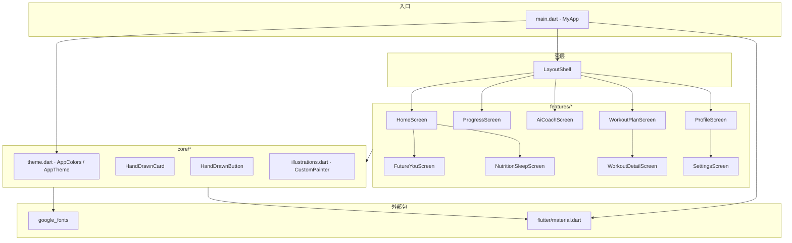
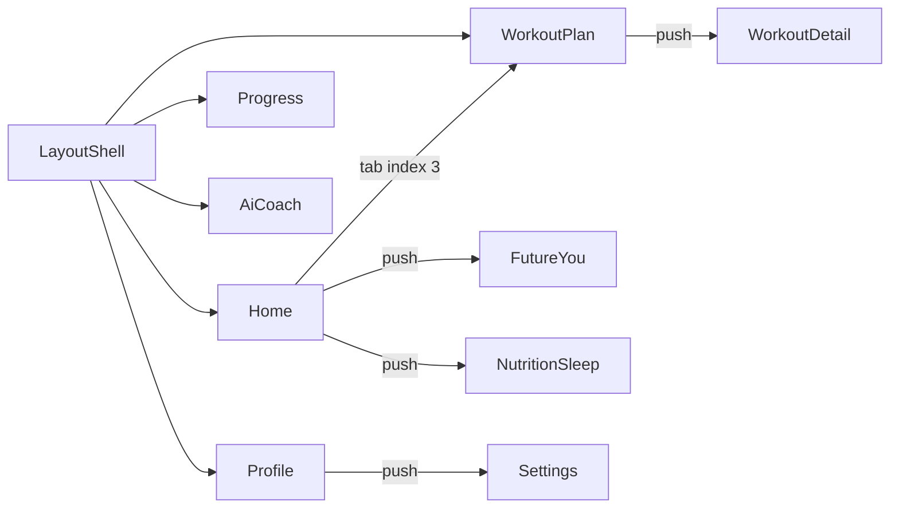

# Logic-of-Hashira / fitness_log_app — Code Wiki

> 本文档基于仓库当前源码自动生成，描述 **Fitness Record App**（Flutter 健身记录 UI 原型）的整体架构、模块职责、关键 API 与运行方式。  
> 包名：`fitness_log_app` · 应用 ID：`com.hashira.logic.fitness_log_app` · 版本：`1.0.0+1`

---

## 目录

1. [项目概览](#1-项目概览)
2. [技术栈与依赖](#2-技术栈与依赖)
3. [整体架构](#3-整体架构)
4. [目录结构](#4-目录结构)
5. [导航与页面流](#5-导航与页面流)
6. [核心层（core）](#6-核心层core)
7. [功能模块（features）](#7-功能模块features)
8. [数据与状态管理](#8-数据与状态管理)
9. [平台工程](#9-平台工程)
10. [运行与构建](#10-运行与构建)
11. [测试](#11-测试)
12. [Trellis 开发工作流](#12-trellis-开发工作流)
13. [已知限制与演进方向](#13-已知限制与演进方向)
14. [附录：图标类型一览](#14-附录图标类型一览)

---

## 1. 项目概览

| 项 | 说明 |
|---|---|
| **定位** | 手绘线稿风格的健身生活方式 App **前端 UI 原型** |
| **核心能力（当前）** | 首页仪表盘、进度可视化、AI 教练聊天（模拟）、周训练计划、营养/睡眠、个人资料与设置 |
| **后端** | 无业务 API；Coach 使用 Firebase AI Logic（Gemini） |
| **状态管理** | 无全局方案（无 Provider/Riverpod/Bloc）；各 `StatefulWidget` 本地 `setState` |
| **设计系统** | 自定义 `AppColors` + Google Fonts（Pangolin / Nunito）+ `CustomPaint` 线稿插画 |

### 产品信息架构（5 Tab）

```
┌─────────────────────────────────────────────────────────────┐
│  LayoutShell (IndexedStack + Bottom Nav)                    │
├─────────┬─────────┬─────────┬─────────┬───────────────────┤
│  Home   │Progress │  Coach  │  Plan   │      Profile        │
│  (0)    │  (1)    │  (2)    │  (3)    │        (4)          │
└─────────┴─────────┴─────────┴─────────┴───────────────────┘
```

从 Home 可 **Push** 到：`FutureYouScreen`、`NutritionSleepScreen`；从 Plan **Push** 到 `WorkoutDetailScreen`；从 Profile **Push** 到 `SettingsScreen`。

---

## 2. 技术栈与依赖

### 运行时

| 技术 | 版本 / 说明 |
|---|---|
| **Flutter** | 3.41.x（stable，本地实测 3.41.9） |
| **Dart SDK** | `^3.11.5`（`pubspec.yaml`） |
| **Material Design** | Material 3（`useMaterial3: true`） |

### `pubspec.yaml` 依赖

| 包 | 用途 |
|---|---|
| `flutter` (SDK) | UI 框架 |
| `cupertino_icons` | iOS 风格图标（脚手架默认，使用较少） |
| `google_fonts` | 动态加载 Pangolin（标题/手绘感）与 Nunito（正文/数字） |
| `flutter_ai_toolkit` | Coach Tab：`LlmChatView` 多轮聊天 UI |
| `firebase_core` | `main()` 中 `Firebase.initializeApp` |
| `firebase_ai` | `FirebaseProvider` / Gemini `generativeModel` |
| `flutter_svg` | 已声明；**当前 `lib/` 源码未引用** |

### 开发依赖

| 包 | 用途 |
|---|---|
| `flutter_test` | Widget 测试 |
| `flutter_lints` | 静态分析规则（`analysis_options.yaml`） |

### 依赖关系图（应用层）



---

## 3. 整体架构

采用 **Feature-first 分层** + **薄入口** 结构，无独立 `data` / `domain` / `repository` 层。

```
lib/
├── main.dart                 # 应用入口、MaterialApp、全局 Theme 片段
├── core/                     # 跨功能共享：主题、手绘组件、CustomPaint
│   ├── theme.dart
│   └── widgets/
│       ├── hand_drawn_card.dart
│       ├── hand_drawn_button.dart
│       └── illustrations.dart   # 大量 CustomPainter（~1000 行）
└── features/                 # 按业务垂直切分
    ├── layout_shell.dart     # 底部 Tab 容器（不属于子 feature 文件夹）
    ├── home/
    ├── progress/
    ├── coach/
    ├── plan/
    ├── profile/
    ├── nutrition/
    └── future_you/
```

### 架构原则（当前实现）

| 原则 | 表现 |
|---|---|
| **UI 即状态** | 列表、聊天、开关等数据写在 State 类字段或 `build` 内常量 |
| **导航** | `Navigator.push` + `MaterialPageRoute`；Tab 切换用 `IndexedStack` 保活 |
| **样式复用** | `HandDrawnCard` / `HandDrawnButton` / `LineArtIconPainter` |
| **主题** | `main.dart` 内联 `ThemeData`；`AppTheme.lightTheme` 已定义但 **未接入** `MaterialApp` |

### 启动链路

```
main()
  └─ runApp(MyApp)
       └─ MaterialApp(home: LayoutShell)
            └─ IndexedStack → 5 个 Tab Screen
```

---

## 4. 目录结构

### 应用源码（`lib/`）

| 路径 | 文件数 | 职责 |
|---|---|---|
| `lib/main.dart` | 1 | `main()`、`MyApp` |
| `lib/core/theme.dart` | 1 | 设计令牌：`AppColors`、`AppTheme` |
| `lib/core/widgets/` | 3 | 可复用手绘 UI 与插画引擎 |
| `lib/features/layout_shell.dart` | 1 | 底部导航 + Tab 栈 |
| `lib/features/*/` | 9 | 各业务页面 Screen |

### 工程与工具（非业务逻辑）

| 路径 | 说明 |
|---|---|
| `android/`、`ios/`、`web/`、`windows/`、`linux/`、`macos/` | Flutter 多平台脚手架 |
| `test/widget_test.dart` | Widget 测试：首页、底栏、Plan/Profile Tab |
| `.trellis/` | Trellis 任务、规范、工作流脚本 |
| `AGENTS.md` | AI 助手项目说明（指向 `.trellis/`） |
| `docs/CODE_WIKI.md` | 本文档 |

---

## 5. 导航与页面流

### Tab 导航（`LayoutShell`）

| Index | 标签 | Screen | 类型 |
|:---:|---|---|---|
| 0 | Home | `HomeScreen` | `StatelessWidget` + `onNavigateToTab` 回调 |
| 1 | Progress | `ProgressScreen` | `StatelessWidget` |
| 2 | Coach | `AiCoachScreen` | `StatefulWidget` |
| 3 | Plan | `WorkoutPlanScreen` | `StatefulWidget` |
| 4 | Profile | `ProfileScreen` | `StatelessWidget` |

**关键实现**：`IndexedStack` 保留各 Tab 状态；`HomeScreen` 通过构造函数注入 `onNavigateToTab`，用于「Start」按钮跳转到 Plan（index 3）。

### 栈导航（Push 页面）

| 来源 | 目标 | 触发条件 |
|---|---|---|
| `HomeScreen` | `FutureYouScreen` | 点击 Hero `HandDrawnCard` |
| `HomeScreen` | `NutritionSleepScreen` | 分类点击 Sleep / Nutrition |
| `WorkoutPlanScreen` | `WorkoutDetailScreen` | 点击 `isWorkout: true` 的日计划项 |
| `ProfileScreen` | `SettingsScreen` | 点击齿轮设置 |

### 导航关系图



---

## 6. 核心层（core）

### 6.1 `AppColors` / `AppTheme` — `lib/core/theme.dart`

#### `AppColors`（静态色板）

| 常量 | 色值 | 用途 |
|---|---|---|
| `canvas` | 白 | 画布背景 |
| `inkBlue` | `#4C36E3` | 主色、强调、进度条 |
| `lightInk` | `#E2DFFF` | 浅色填充、完成态背景 |
| `softLilac` | `#F3F0FF` | 卡片/聊天气泡底色 |
| `border` | `#E2E8F0` | 边框 |
| `inkText` | `#1E1B4B` | 主文字 |
| `grayText` | `#6E7191` | 次要文字 |
| `softGray` | `#F8FAFC` | 浅灰背景 |
| `activeGauge` | `#6366F1` | 仪表（预留） |

#### `AppTheme.lightTheme`

完整的 `ThemeData`（含 Pangolin/Nunito `textTheme`），**建议**在 `MyApp` 中替换内联 `theme:` 以统一字体层级。

---

### 6.2 `HandDrawnCard` — `lib/core/widgets/hand_drawn_card.dart`

手绘风格容器：圆角边框 + 轻阴影，可选点击。

| 参数 | 类型 | 默认 | 说明 |
|---|---|---|---|
| `child` | `Widget` | 必填 | 内容 |
| `padding` | `EdgeInsetsGeometry?` | `20` | 内边距 |
| `color` | `Color` | `AppColors.canvas` | 背景 |
| `borderColor` / `borderWidth` | | `border` / `1.2` | 描边 |
| `borderRadius` | `double` | `24` | 圆角 |
| `onTap` | `VoidCallback?` | null | 非空时包 `GestureDetector` |
| `elevation` | `double` | `0` | 影响阴影偏移 |

---

### 6.3 `HandDrawnButton` — `lib/core/widgets/hand_drawn_button.dart`

| 枚举 `HandDrawnButtonStyle` | 外观 |
|---|---|
| `primary` | 蓝底白字、圆角胶囊、阴影 |
| `secondary` | 白底描边 |
| `chip` | 浅紫底、小尺寸（用于 Home「Start」） |

| 参数 | 说明 |
|---|---|
| `text` | 按钮文案 |
| `onTap` | 点击回调 |
| `width` / `height` | 尺寸；chip 模式高度固定约 32 |
| `icon` | 可选前置图标 |

---

### 6.4 `illustrations.dart` — 插画与图标引擎

> 单文件约 1000+ 行，所有视觉均为 **矢量 `CustomPaint`**，无位图 assets。

#### 组件 / Painter 类一览

| 类名 | 类型 | 使用场景 |
|---|---|---|
| `HandDrawnIllustration` | `StatelessWidget` | 包装任意 `CustomPainter` |
| `ChestPortraitPainter` | `CustomPainter` | Home 胸像 Hero |
| `BodyComparisonPainter` | `CustomPainter` | Future You 身体对比 |
| `MountainTrailPainter` | `CustomPainter` | Progress 登山进度 metaphor |
| `MoonAndStarsPainter` | `CustomPainter` | Sleep Tab 月相 |
| `PeekingSleeperPainter` | `CustomPainter` | Sleep Tab 底部装饰 |
| `RobotCoachPainter` | `CustomPainter` | AI Coach 头像 |
| `LineArtIconPainter` | `CustomPainter` | 通用线稿图标（`iconType` 字符串路由） |

#### `LineArtIconPainter`

- **构造**：`LineArtIconPainter({ required iconType, color })`
- **行为**：`switch (iconType.toLowerCase())` 绘制对应路径；未知类型画圆占位
- **`shouldRepaint`**：恒 `false`（静态图标）

---

## 7. 功能模块（features）

### 7.1 `LayoutShell` — `lib/features/layout_shell.dart`

| 成员 | 说明 |
|---|---|
| `_currentIndex` | 当前 Tab |
| `_screens` | `initState` 中构建的 5 屏列表 |
| `_buildNavItem` | 底部项：线稿图标 + Pangolin 标签 + 选中指示条 |

**依赖**：`google_fonts`、`LineArtIconPainter`、各 feature screen。

---

### 7.2 `HomeScreen` — `lib/features/home/home_screen.dart`

| 成员 | 说明 |
|---|---|
| `onNavigateToTab` | `Function(int)`，父级 Tab 切换 |
| `_buildCategoryItem` | 横向分类：Strength/Cardio/Mindset/Recovery → SnackBar；Sleep/Nutrition → Push |

**UI 区块**：年份选择器、通知铃铛、分类横滑、问候语、Future You 卡片、Today\'s Focus + Start。

**Mock 用户**：`Alex`。

---

### 7.3 `ProgressScreen` — `lib/features/progress/progress_screen.dart`

静态进度仪表盘：

| 数据（硬编码） | 示例 |
|---|---|
| 左侧指标 | Training +12%、Strength +8%、Endurance +6% |
| 右侧指标 | Body Fat -4%、Fat loss detected |
| 中央 | `MountainTrailPainter` |
| 底部 | 激励文案卡片 |

`_buildStatItem(label, value, isPositive)` — 构建单侧统计列。

---

### 7.4 Coach — `lib/features/coach/`

| 文件 | 说明 |
|------|------|
| `ai_coach_screen.dart` | 保留手绘顶栏 + `LlmChatView` 聊天区 |
| `ai_coach_provider.dart` | `FirebaseProvider` + Gemini；测试无 Firebase 时用 `EchoProvider` |
| `ai_coach_chat_style.dart` | `LlmChatViewStyle` 对齐 `AppColors` |

| 成员 | 说明 |
|---|---|
| `_provider` | `LlmProvider`，在 `initState` 通过 `createAiCoachProvider()` 创建 |
| `createAiCoachGenerativeModel()` | `FirebaseAI.googleAI().generativeModel(model: gemini-2.5-flash, systemInstruction: …)` |

**依赖**：[Flutter AI Toolkit](https://docs.flutter.dev/ai/ai-toolkit#get-started)。`main.dart` 中 `Firebase.initializeApp(options: DefaultFirebaseOptions.currentPlatform)`。

**UI**：顶栏 `RobotCoachPainter` 不变；消息区为 toolkit 默认组件（已禁用附件与语音 `enableAttachments: false`, `enableVoiceNotes: false`）。

---

### 7.5 `WorkoutPlanScreen` — `lib/features/plan/workout_plan_screen.dart`

| 状态 / 数据 | 说明 |
|---|---|
| `_selectedDayIndex` | 周几选择（0=Mon） |
| `_weekDays` | 7 天标签 |
| `_workouts` | 每日计划：`title`、`subtitle`、`icon`、`completed`、`isWorkout` |

**交互**：

- 点击工作日圆点 → `setState` 高亮对应列表项边框
- 点击卡片：`isWorkout` → `WorkoutDetailScreen`；否则 SnackBar（恢复/休息日）

---

### 7.6 `WorkoutDetailScreen` — `lib/features/plan/workout_detail_screen.dart`

| 构造参数 | 说明 |
|---|---|
| `workoutName` | 训练日名称（如 Push Day） |
| `workoutCategory` | 肌群副标题 |

**内容**：时长/卡路里元数据卡、动作列表（Bench Press 等 4 项）、底部 `HandDrawnButton`「Start Workout」→ SnackBar。

`exercises` 列表在 `build` 内局部定义。

---

### 7.7 `NutritionSleepScreen` — `lib/features/nutrition/nutrition_sleep_screen.dart`

| 成员 | 说明 |
|---|---|
| `initialTab` | `0` Nutrition / `1` Sleep |
| `_selectedTab` | 分段 Tab 状态 |

**Nutrition Tab**：宏量进度条（Calories/Protein/Carbs/Fat）、食物图标格、`Today\'s Meals` 卡片。

**Sleep Tab**：月相插画、昨晚时长/质量、睡眠阶段堆叠条、`PeekingSleeperPainter`。

**私有方法**：`_buildNutritionContent`、`_buildSleepContent`、`_buildMacroGauge`、`_buildFoodIconCard`、`_buildLegend`。

---

### 7.8 `FutureYouScreen` — `lib/features/future_you/future_you_screen.dart`

「未来自我」可视化：左右指标 + 中央 `BodyComparisonPainter` + 底部激励卡。

`_buildMetricItem(label, value, change)` — 带上升箭头的指标块。

---

### 7.9 `ProfileScreen` — `lib/features/profile/profile_screen.dart`

| 区块 | Mock 数据 |
|---|---|
| 用户 | Alex Mercer，Habit lvl 4 |
| 统计 | Consistency 72%、Workouts 18、Streak 5d |
| 成就 | Early Bird、Consistency King、Deep Sleeper |

`_buildStatBox`、`_buildBadgeItem` — 局部 UI 构建器。

---

### 7.10 `SettingsScreen` — `lib/features/profile/settings_screen.dart`

| 状态字段 | 默认值 | UI |
|---|---|---|
| `_gymReminders` | `true` | 训练提醒 Switch |
| `_sleepReminders` | `false` | 睡眠提醒 Switch |
| `_googleFitLinked` | `true` | Google Fit 联动 Switch |

分区：Account、Notifications、Integrations；页脚版本 `1.0.0`。

---

## 8. 数据与状态管理

### 当前模式

```
┌──────────────────────────────────────┐
│  无持久化 · 无网络 · 无全局 Store      │
│  Mock 数据 → Widget State / 局部常量   │
└──────────────────────────────────────┘
```

| 场景 | 实现 |
|---|---|
| Tab 切换 | `LayoutShell._currentIndex` |
| 教练聊天 | `LlmProvider`（`FirebaseProvider` / 测试时 `EchoProvider`）由 `LlmChatView` 管理 |
| 训练日选择 | `WorkoutPlanScreen._selectedDayIndex` |
| 设置开关 | `SettingsScreen` 三个 `bool` |
| 营养/睡眠 Tab | `NutritionSleepScreen._selectedTab` |

### 引入真实数据时的建议切分

| 层 | 建议路径 | 职责 |
|---|---|---|
| `models/` | `workout.dart`, `user_profile.dart` | 不可变数据类 |
| `repositories/` | `workout_repository.dart` | API / 本地 DB |
| `providers/` 或 `bloc/` | 按 feature | 与 UI 解耦的状态 |

---

## 9. 平台工程

| 平台 | 路径 | 备注 |
|---|---|---|
| **Android** | `android/` | `applicationId`: `com.hashira.logic.fitness_log_app`；`MainActivity` 为标准 `FlutterActivity` |
| **iOS** | `ios/` | Flutter 默认 Runner |
| **Web / Desktop** | `web/`, `windows/`, `linux/`, `macos/` | 脚手架存在，未针对手绘 UI 做专项适配 |

**资源**：`pubspec.yaml` 未声明 `assets:`；字体通过 `google_fonts` 运行时下载。

---

## 10. 运行与构建

### 环境要求

- Flutter SDK ≥ 3.41（与 Dart 3.11.5 匹配）
- 对应平台 SDK（Android Studio / Xcode 等）

### 常用命令

```bash
# 进入项目根目录
cd d:\Logic-of-Hashira

# 安装依赖
flutter pub get

# 静态分析
flutter analyze

# 运行（自动选择已连接设备）
flutter run

# 指定设备
flutter devices
flutter run -d <device_id>

# 发布构建示例
flutter build apk
flutter build ios
flutter build web
```

### 首次运行检查清单

1. `flutter doctor` 无阻塞项  
2. `flutter pub get` 成功  
3. 设备/模拟器已连接  
4. 需网络：首次加载 Google Fonts  

---

## 11. 测试

| 文件 | 状态 |
|---|---|
| `test/widget_test.dart` | 4 个 widget 测试：首页问候、底栏 5 Tab、Plan/Profile 切换 |

```bash
flutter test
```

---

## 12. Trellis 开发工作流

本项目由 [Trellis](https://github.com/) 管理 AI 协作流程，详见：

| 资源 | 路径 |
|---|---|
| AI 入口说明 | `AGENTS.md` |
| 工作流 | `.trellis/workflow.md` |
| **Flutter 前端规范（已填充）** | `.trellis/spec/frontend/`（入口 [index.md](../.trellis/spec/frontend/index.md)） |
| **后端规范（占位）** | `.trellis/spec/backend/`（无服务端；见 index 团队备注） |
| 活动任务 | `.trellis/tasks/` |
| **Trellis 中文教程** | [docs/TRELLIS_TUTORIAL.md](TRELLIS_TUTORIAL.md) |

### 典型命令

```bash
python ./.trellis/scripts/init_developer.py <name>
python ./.trellis/scripts/task.py create "<title>"
python ./.trellis/scripts/get_context.py --mode packages
```

### 与 Flutter 开发的关系

- **文档/分析类任务**（如本文档）：可直接在主会话完成  
- **功能实现**：按 `workflow.md` 应走 `trellis-implement` → `trellis-check` 子代理（除非用户显式要求 inline）

---

## 13. 已知限制与演进方向

| 限制 | 说明 |
|---|---|
| 无真实后端 | 无法同步训练记录、用户账号 |
| Mock AI 教练 | 固定延迟 + 模板回复，无 LLM API |
| 主题未统一 | `AppTheme.lightTheme` 未用于 `MaterialApp` |
| `flutter_svg` 未使用 | 可考虑移除或用于复杂图标 |
| Widget 测试过期 | 需按实际 UI 重写 |
| 无国际化 | 文案硬编码英文 |
| 无无障碍专项 | Semantics / 对比度未审计 |
| Trellis spec 为空壳 | `directory-structure.md` 等待团队填写 |

### 推荐演进优先级

1. 接入 `AppTheme.lightTheme`，删除 `main.dart` 重复 Theme 配置  
2. 抽取 `models/` + 假数据 `fixtures/`，Screen 只负责展示  
3. 引入 `go_router` 或命名路由，统一深链  
4. 修复/扩展 `widget_test` 与 golden tests（插画风快照）  
5. 对接真实 API（教练、计划、营养、睡眠数据源）

---

## 14. 附录：图标类型一览

`LineArtIconPainter` 支持的 `iconType`（大小写不敏感）：

| iconType | 语义 |
|---|---|
| `strength` | 哑铃 |
| `cardio` | 跑鞋 |
| `sleep` | 弯月 |
| `nutrition` | 碗/食物 |
| `mindset` | 莲花/心态 |
| `recovery` | 十字绷带 |
| `home` | 房屋（底栏） |
| `progress` | 折线图（底栏） |
| `coach` | 对话气泡（底栏） |
| `profile` | 头像剪影（底栏） |
| `calendar` | 日历 |
| `gear` | 齿轮设置 |
| `edit` | 铅笔 |
| `share` | 分享 |
| `benchpress` | 卧推示意 |
| `inclinepress` | 上斜卧推 |
| `shoulderpress` | 肩推 |
| `triceppushdown` | 三头下压 |
| `avocado` | 牛油果 |
| `meat` | 牛排 |
| `broccoli` | 西兰花 |
| `flame` | 火焰 |
| *(其他)* | 默认圆圈占位 |

---

## 文档维护

| 项 | 值 |
|---|---|
| **生成依据** | `lib/**/*.dart`、`pubspec.yaml`、平台配置 |
| **建议更新时机** | 新增 feature 目录、引入状态管理/路由、依赖变更、接入 API 后 |
| **维护者** | 随代码变更同步修订本节与对应章节 |

---

*Logic-of-Hashira · Fitness Record App · Code Wiki*
