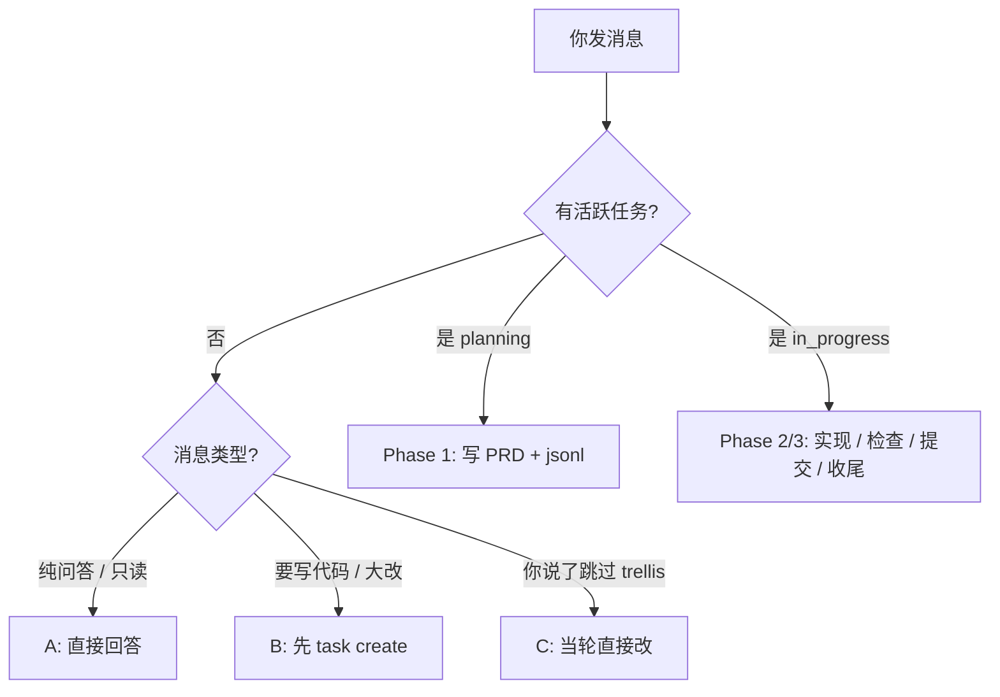

# Trellis 使用教程与流程

> 面向 **Logic-of-Hashira**（Cursor + Flutter）的实操指南。  
> 权威细则见 [.trellis/workflow.md](../.trellis/workflow.md)；AI 入口见 [AGENTS.md](../AGENTS.md)。

---

## 目录

1. [Trellis 是什么](#1-trellis-是什么)
2. [仓库里有什么](#2-仓库里有什么)
3. [一次性准备](#3-一次性准备)
4. [三种工作模式](#4-三种工作模式)
5. [完整流程（三阶段）](#5-完整流程三阶段)
6. [Cursor 专用：命令与子代理](#6-cursor-专用命令与子代理)
7. [命令速查](#7-命令速查)
8. [本项目的 spec 怎么用](#8-本项目的-spec-怎么用)
9. [示例：从 0 做一个新功能](#9-示例从-0-做一个新功能)
10. [常见问题](#10-常见问题)

---

## 1. Trellis 是什么

Trellis 是挂在仓库里的 **AI 协作工作流**，不是 Flutter 依赖包。它帮你：

| 能力 | 说明 |
|------|------|
| **任务化** | 每个功能一个目录：PRD、调研、上下文清单 |
| **规范注入** | `.trellis/spec/` 里的约定自动喂给实现/检查子代理 |
| **分阶段** | 先 Plan → 再 Execute → 最后 Finish，减少「聊着聊着就偏了」 |
| **可追溯** | 工作区 journal 记录你做过哪些会话 |

**适合走 Trellis 的事**：新功能、重构、接 API、修一批有范围的 bug。  
**不必建任务的事**：纯问答、只看代码、改 1～2 行且你明确说「直接改 / 跳过 trellis」。

---

## 2. 仓库里有什么

```
.trellis/
├── workflow.md          # 完整流程（英文，权威）
├── config.yaml          # 项目配置（journal 行数、hooks 等）
├── spec/
│   ├── frontend/        # Flutter 规范（已填充 + 团队备注）
│   └── backend/         # 后端占位（当前无服务端）
├── tasks/               # 进行中的任务
│   └── 00-bootstrap-guidelines/
├── workspace/<开发者>/  # 个人 journal
└── scripts/
    ├── task.py          # 任务 CRUD
    ├── get_context.py   # 查阶段/包/spec
    ├── init_developer.py
    └── add_session.py   # 会话收尾记录

.cursor/
├── commands/            # /trellis:continue、/trellis:finish-work
└── agents/              # trellis-implement / check / research

.claude/skills/          # trellis-brainstorm、check、update-spec 等
```

与本项目文档的关系：

| 文档 | 作用 |
|------|------|
| [CODE_WIKI.md](./CODE_WIKI.md) | **代码是什么**（架构、模块、类） |
| [TRELLIS_TUTORIAL.md](./TRELLIS_TUTORIAL.md) | **怎么协作开发**（本文件） |
| `.trellis/spec/frontend/` | **代码该怎么写**（给 AI 的执行契约） |

---

## 3. 一次性准备

### 3.1 初始化开发者身份（首次）

```bash
cd d:\Logic-of-Hashira
python ./.trellis/scripts/init_developer.py <你的名字>
```

会生成：

- `.trellis/.developer`（本地，通常 gitignore）
- `.trellis/workspace/<你的名字>/journal-1.md`、`index.md`

本仓库已有开发者 `sjzjams` 时，你用自己的名字再 init 一次即可。

### 3.2 环境

- Python 3（跑 `task.py`）
- Flutter / Cursor 已配置
- 可选：在 Cursor 里使用 Trellis 相关 **Skills** 与 **Commands**（见第 6 节）

### 3.3 了解当前任务（可选）

```bash
python ./.trellis/scripts/task.py list
python ./.trellis/scripts/task.py current --source
```

---

## 4. 三种工作模式

AI 每轮对话会根据 **是否有活跃任务** 进入不同模式（见 `workflow.md` 的 `[workflow-state:...]`）：



| 模式 | 你怎么触发 | AI 应做什么 |
|------|------------|-------------|
| **A 直接回答** | 「这段代码什么意思？」且不涉及改仓库 | 简短回答，不建任务 |
| **B 走任务** | 「加 Riverpod」「做登录页」 | `task.py create` → Plan → Start → 实现 |
| **C 跳过流程** | 明确说：**跳过 trellis / 直接改 / 别建任务** | 当轮 inline 改代码，不强制子代理 |

> 「改动很小」**不能**自动当成 A 或 C；想跳过必须**你亲口说**跳过话术。

---

## 5. 完整流程（三阶段）

### 总览

```
Phase 1: Plan     → 需求清楚、PRD、implement/check.jsonl、task.py start
Phase 2: Execute  → trellis-implement → trellis-check（可循环）
Phase 3: Finish   → trellis-update-spec → git commit → /trellis:finish-work
```

### Phase 1：Plan（`status: planning`）

| 步骤 | 动作 | 产出 |
|------|------|------|
| **1.0** | `task.py create "标题" [--slug 英文名]` | 任务目录 `.trellis/tasks/MM-DD-名称/` |
| **1.1** | 用 **trellis-brainstorm** 和 AI 聊需求 | 更新 `prd.md` |
| **1.2** | 可选：派 **trellis-research** 调研 | `research/*.md` |
| **1.3** | 编辑 `implement.jsonl`、`check.jsonl` | 子代理要读的 spec/调研路径 |
| **1.4** | `task.py start <任务目录名>` | `status` → `in_progress` |
| **1.5** | 确认 PRD、jsonl、用户认可 | 可进入 Phase 2 |

**注意**：`create` 之后**不要立刻** `start`；先完成 1.1～1.3，否则 AI 会跳过规划直接写代码。

#### `implement.jsonl` / `check.jsonl` 格式

每行一个 JSON（仓库相对路径）：

```json
{"file": ".trellis/spec/frontend/directory-structure.md", "reason": "Flutter 目录约定"}
{"file": ".trellis/spec/frontend/component-guidelines.md", "reason": "HandDrawn 组件"}
```

- **implement.jsonl**：实现子代理必读  
- **check.jsonl**：检查子代理必读（可与 implement 重叠）  
- 只有种子行 `_example` **不算**填完，需删掉或换成真实条目  

对本 Flutter 项目，建议至少登记：

- `.trellis/spec/frontend/directory-structure.md`
- `.trellis/spec/frontend/component-guidelines.md`
- `.trellis/spec/frontend/state-management.md`
- `.trellis/spec/frontend/quality-guidelines.md`
- 本任务的 `prd.md`、`research/*.md`（如有）

---

### Phase 2：Execute（`status: in_progress`）

| 步骤 | 动作 |
|------|------|
| **2.1** | 派 **trellis-implement**：按 `prd.md` 写代码，跑 `flutter analyze` |
| **2.2** | 派 **trellis-check**：对照 spec/PRD 审查并修问题 |
| **2.3** | 不通过则修代码 → 再 check；PRD 错了回到 Phase 1 改 `prd.md` |

**Cursor 默认**：主会话**不直接大改代码**，而是派子代理（除非你说了「你直接改 / 不用 sub-agent」）。

推荐循环：

```
implement → check → (修) → check 通过
```

---

### Phase 3：Finish（仍为 `in_progress`，直到 archive）

| 步骤 | 动作 |
|------|------|
| **3.1** | 再跑一遍 **trellis-check**（最终确认） |
| **3.2** | 可选：反复踩坑时用 **trellis-break-loop** 写复盘 |
| **3.3** | **trellis-update-spec**：把新约定写进 `.trellis/spec/` |
| **3.4** | **提交代码**：AI 列出 commit 计划，你回复 `ok` 后 `git commit`（不在 finish-work 里提交） |
| **3.5** | 提醒运行 **`/trellis:finish-work`** |

**`/trellis:finish-work` 做什么**（不提交业务代码）：

1. 检查工作区是否还有**本任务**未提交代码 → 有则回到 3.4  
2. `task.py archive <任务名>` → 任务移到 `archive/`  
3. `add_session.py` 写 journal  

---

## 6. Cursor 专用：命令与子代理

### Slash 命令

| 命令 | 何时用 |
|------|--------|
| **`/trellis:continue`** | 断点续作：自动判断在 Plan/Execute/Finish 哪一步 |
| **`/trellis:finish-work`** | 本任务代码已 commit，要归档任务 + 记 journal |

`continue` 会先跑：

```bash
python ./.trellis/scripts/get_context.py
python ./.trellis/scripts/get_context.py --mode phase
```

### 子代理（`.cursor/agents/`）

| 子代理 | 用途 |
|--------|------|
| **trellis-implement** | 按 PRD 实现；读 `implement.jsonl` 注入的 spec |
| **trellis-check** | 质量检查、lint、对照 PRD |
| **trellis-research** | 调研写进 `research/*.md` |

### Skills（`.claude/skills/`）

| Skill | 用途 |
|-------|------|
| **trellis-brainstorm** | Phase 1 需求探索 |
| **trellis-check** | 主会话自己做检查时 |
| **trellis-update-spec** | Phase 3.3 更新规范 |
| **trellis-break-loop** | 反复修同一类 bug 时 |
| **trellis-before-dev** | 部分平台主会话实现前读 spec（Cursor 实现主要靠子代理 + jsonl） |

### 主会话 vs 子代理（Cursor）

```
你 → 主会话（规划、PRD、jsonl、commit 计划、finish-work）
        ↓ 派发
     trellis-implement / trellis-check / trellis-research
```

---

## 7. 命令速查

### 任务

```bash
# 创建（slug 不要带日期前缀，脚本会自动加 MM-DD-）
python ./.trellis/scripts/task.py create "接入 Riverpod 状态管理" --slug riverpod-state

# 列出 / 当前任务
python ./.trellis/scripts/task.py list
python ./.trellis/scripts/task.py current --source

# 进入实现阶段
python ./.trellis/scripts/task.py start 05-21-riverpod-state

# 登记子代理要读的规范
python ./.trellis/scripts/task.py add-context 05-21-riverpod-state implement \
  ".trellis/spec/frontend/state-management.md" "状态管理约定"

python ./.trellis/scripts/task.py list-context 05-21-riverpod-state implement

# 清除活跃指针（不归档）
python ./.trellis/scripts/task.py finish

# 归档完成
python ./.trellis/scripts/task.py archive 05-21-riverpod-state
```

### 上下文与阶段

```bash
python ./.trellis/scripts/get_context.py --mode packages
python ./.trellis/scripts/get_context.py --mode phase --step 1.1
python ./.trellis/scripts/get_context.py --mode record   # finish-work 前用
```

### 会话记录

```bash
python ./.trellis/scripts/add_session.py \
  --title "完成 Riverpod 骨架" \
  --commit "abc1234" \
  --summary "引入 ProviderScope，迁移 Home 只读状态"
```

---

## 8. 本项目的 spec 怎么用

| 路径 | 状态 | 何时写进 jsonl |
|------|------|----------------|
| `.trellis/spec/frontend/*` | **已填充** | 几乎所有 UI 任务 |
| `.trellis/spec/backend/*` | **占位** | 仅在有 API/服务端任务时 |
| `docs/CODE_WIKI.md` | 架构文档 | 大改结构时给 implement/check 参考 |
| `健身记录app.md` | 视觉规范 | UI 还原、插画相关任务 |

规范文末有中文 **团队备注**；正文英文便于 AI 解析。

**更新规范**：任务结束时用 **trellis-update-spec**，例如发现「新 Screen 必须放 `features/<名>/`」就写入 `directory-structure.md`。

---

## 9. 示例：从 0 做一个新功能

目标：**给设置页的通知开关接本地持久化（shared_preferences）**。

### Step 1 — 创建任务

```bash
python ./.trellis/scripts/task.py create "设置项本地持久化" --slug settings-persistence
```

假设生成目录：`.trellis/tasks/05-21-settings-persistence/`

### Step 2 — 写 PRD（与 AI  brainstorm）

在 Cursor 中说：

> 帮我用 trellis-brainstorm 完善 `05-21-settings-persistence` 的 prd.md：只用 shared_preferences 存三个开关，不改 UI 样式。

`prd.md` 应包含：范围、验收标准、不改什么、测试要求。

### Step 3 — 配置 jsonl

编辑 `implement.jsonl`（示例）：

```json
{"file": ".trellis/tasks/05-21-settings-persistence/prd.md", "reason": "需求范围"}
{"file": ".trellis/spec/frontend/directory-structure.md", "reason": "目录"}
{"file": ".trellis/spec/frontend/state-management.md", "reason": "状态与持久化边界"}
{"file": ".trellis/spec/frontend/quality-guidelines.md", "reason": "analyze/test"}
```

`check.jsonl` 可同样加上 `quality-guidelines.md` 与 `prd.md`。

```bash
python ./.trellis/scripts/task.py validate 05-21-settings-persistence
```

### Step 4 — 启动实现阶段

```bash
python ./.trellis/scripts/task.py start 05-21-settings-persistence
```

对 AI 说：

> 请派 trellis-implement 按 prd 实现，完成后 flutter analyze 和 flutter test。

再派 **trellis-check** 审查。

### Step 5 — 收尾

1. **trellis-update-spec**：在 `state-management.md` 补充 shared_preferences 约定  
2. 确认 `git status` 干净或按 AI 的 commit 计划提交  
3. 运行 **`/trellis:finish-work`**

---

## 10. 常见问题

### Q：`task.py start` 报错 session identity？

需要 Cursor/Trellis hook 提供会话 ID，或设置环境变量 `TRELLIS_CONTEXT_ID`。按终端提示配置后重试。

### Q：能不能不建任务就改一行？

可以，但你要**明确说**：「直接改 / 跳过 trellis / 别建任务」。否则 AI 应按 workflow 建任务。

### Q：bootstrap 任务 `00-bootstrap-guidelines` 还要 archive 吗？

前端 spec 与测试已写好；若你确认不再改 bootstrap，可 commit 后：

```bash
python ./.trellis/scripts/task.py archive 00-bootstrap-guidelines
```

### Q：finish-work 提示 working tree dirty？

说明 **Phase 3.4 还没 commit 业务代码**。先提交 `lib/`、`test/` 等，再 `/trellis:finish-work`。`.trellis/tasks/` 与 `workspace/` 的变更由脚本单独处理。

### Q：和 CODE_WIKI 谁维护？

| 变更类型 | 更新 |
|----------|------|
| 加了新 feature 目录、导航 | CODE_WIKI + 可选 spec `directory-structure` |
| 新团队约定「必须怎么写」 | `.trellis/spec/frontend/*.md` |
| 流程本身 | `.trellis/workflow.md`（trellis update 管理） |

### Q：后端 spec 全是占位，要填吗？

当前 **无服务端** 不必填。接 API 时再开新任务，填 `spec/backend/` 并建 `lib/repositories/`。

---

## 流程一图流（打印用）

```
┌─────────────┐
│ task create │  planning
└──────┬──────┘
       ▼
┌─────────────┐     research/*.md
│ PRD+jsonl   │ ←── trellis-brainstorm / trellis-research
└──────┬──────┘
       ▼
┌─────────────┐
│ task start  │  in_progress
└──────┬──────┘
       ▼
┌─────────────┐     ┌─────────────┐
│ implement   │ ──► │   check     │──┐
└─────────────┘     └─────────────┘  │ fail
       ▲                              │
       └──────────────────────────────┘
       ▼ pass
┌─────────────┐
│ update-spec │
└──────┬──────┘
       ▼
┌─────────────┐
│ git commit  │  Phase 3.4
└──────┬──────┘
       ▼
┌─────────────┐
│finish-work  │  archive + journal
└─────────────┘
```

---

## 相关链接

- [AGENTS.md](../AGENTS.md) — AI 助手项目说明  
- [.trellis/workflow.md](../.trellis/workflow.md) — 完整英文流程  
- [.trellis/spec/frontend/index.md](../.trellis/spec/frontend/index.md) — Flutter 规范索引  
- [CODE_WIKI.md](./CODE_WIKI.md) — 代码架构百科  

---

*Logic-of-Hashira · Trellis 教程 · 与 workflow v0.5+ 对齐*
