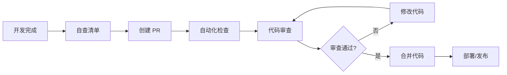

# Logic-of-Hashira 代码审查流程

> 版本: 1.0 | 更新日期: 2026-06-10 | 适用: GitHub PR 工作流

---

## 📋 目录

1. [流程概览](#流程概览)
2. [角色职责](#角色职责)
3. [详细流程](#详细流程)
4. [自动化配置](#自动化配置)
5. [紧急情况处理](#紧急情况处理)
6. [度量指标](#度量指标)

---

## 🔄 流程概览



**关键原则**:
- 所有代码必须经过审查（除了文档变更）
- 小 PR（< 300 行）优先审查
- 24 小时内给出首次审查反馈

---

## 👥 角色职责

### 作者（Author）
**职责**:
- 确保代码符合审查标准
- 编写清晰的 PR 描述
- 及时回应审查意见
- 解决合并冲突

**自查清单**:
```bash
# 1. 代码分析
flutter analyze

# 2. 自动修复
dart fix --apply

# 3. 运行测试
flutter test

# 4. 检查格式化
dart format --set-exit-if-changed .

# 5. 构建检查
flutter build apk --debug
```

---

### 审查者（Reviewer）
**职责**:
- 提供建设性、及时的反馈
- 关注代码的正确性和可维护性
- 提出改进建议（而非强制要求）
- 最终决定是否批准合并

**审查时间分配**:
- 首次快速浏览（5 分钟）：理解变更意图
- 详细审查（15-30 分钟）：逐行检查
- 总结反馈：优先级分类

**小团队建议**: 
- 1-3 人团队：所有人互审
- 可邀请外部贡献者审查（如适用）

---

### 维护者（Maintainer）
**职责**:
- 最终合并决策
- 确保流程执行
- 处理紧急发布
- 改进审查流程

**合并权限**:
- 只有维护者可以合并到 `main`/`master` 分支
- 可以设置分支保护规则

---

## 📝 详细流程

### 阶段 1: 开发完成前

#### 1.1 创建功能分支
```bash
# 从 main 分支创建
git checkout main
git pull origin main
git checkout -b feature/exercise-tracking

# 分支命名规范
# feature/xxx - 新功能
# fix/xxx - Bug 修复
# refactor/xxx - 重构
# perf/xxx - 性能优化
# docs/xxx - 文档更新
```

#### 1.2 开发过程中
- 保持提交历史清晰（使用 conventional commits）
- 频繁推送以避免丢失工作
- 可创建 WIP (Work In Progress) PR 早期获取反馈

```bash
# 提交信息规范
feat: add exercise duration tracking
fix: resolve memory leak in camera screen
refactor: extract exercise logic from UI
perf: optimize list rendering with const widgets
docs: update API documentation
```

---

### 阶段 2: 创建 Pull Request

#### 2.1 PR 准备
- [ ] 确保所有测试通过
- [ ] 更新相关文档
- [ ] 添加截图/录屏（如涉及 UI）
- [ ] 填写 PR 模板

#### 2.2 创建 PR
1. 推送到远程仓库
```bash
git push origin feature/exercise-tracking
```

2. 在 GitHub 创建 PR
   - 使用 PR 模板（见下文配置）
   - 关联相关 Issue
   - 添加适当标签（feature, bug, etc.）
   - 指定审查者（建议 1-2 人）

3. PR 标题规范
```
feat: 添加运动时长追踪功能
fix: 修复相机页面内存泄漏
refactor: 重构运动逻辑与 UI 分离
```

---

### 阶段 3: 自动化检查

#### 3.1 自动触发检查
GitHub Actions 会自动运行：
- ✅ `flutter analyze` - 静态分析
- ✅ `flutter test` - 单元测试
- ✅ `dart format` - 代码格式化检查
- ✅ `flutter build` - 构建检查

#### 3.2 处理失败
- 所有检查必须通过才能合并
- 失败时，作者需修复后重新推送
- 可在本地运行相同命令调试

---

### 阶段 4: 代码审查

#### 4.1 审查者响应
- **目标时间**: 24 小时内给出首次反馈
- **小 PR 优先**: < 300 行的 PR 优先审查
- **紧急 PR**: 标注 `urgent` 标签，4 小时内审查

#### 4.2 审查过程
1. **理解变更**
   - 阅读 PR 描述
   - 查看相关 Issue
   - 理解"为什么"而不仅是"是什么"

2. **逐行审查**
   - 使用 GitHub PR 审查功能
   - 按优先级分类评论（🔴🟡💭）
   - 提出具体问题而非模糊意见

3. **测试验证**（如需要）
   - 拉取分支到本地
   - 手动测试关键流程
   - 运行性能分析（如涉及性能优化）

4. **提交审查意见**
   - `Request Changes` - 有 🔴 blocker 问题
   - `Approve` - 无 🔴 blocker，可以合并
   - `Comment` - 只有 💭 nits，可选择批准

#### 4.3 作者修改
- 逐条回应审查意见
- 说明修改或解释设计决策
- 推送修改后 @ 审查者重新审查
- 避免强制推送（force push）到公共分支

---

### 阶段 5: 合并代码

#### 5.1 合并条件
- ✅ 所有自动化检查通过
- ✅ 至少 1 人批准（小团队可设 0 人）
- ✅ 无 🔴 blocker 评论
- ✅ 合并冲突已解决

#### 5.2 合并方式
**推荐**: Squash and merge
- 保持提交历史清晰
- 单个 PR = 单个提交

**配置**:
```bash
# GitHub 仓库设置
Settings > General > Pull Requests
✅ Allow squash merging
✅ Allow merge commits (可选)
❌ Allow rebase merging (避免)
```

#### 5.3 合并后
- 删除功能分支（远程和本地）
- 关闭相关 Issue
- 标记版本号（如适用）

---

## ⚙️ 自动化配置

### GitHub Actions 配置

创建 `.github/workflows/pr-checks.yml`:

```yaml
name: PR Checks

on:
  pull_request:
    branches: [ main, master ]

jobs:
  analyze:
    name: Analyze & Test
    runs-on: ubuntu-latest
    
    steps:
      - uses: actions/checkout@v4
      
      - name: Setup Flutter
        uses: subosito/flutter-action@v2
        with:
          flutter-version: 'stable'
      
      - name: Install dependencies
        run: flutter pub get
      
      - name: Verify formatting
        run: dart format --set-exit-if-changed .
      
      - name: Analyze project source
        run: flutter analyze
      
      - name: Run tests
        run: flutter test
      
      - name: Build check (Android)
        run: flutter build apk --debug
```

### 分支保护规则

在 GitHub 仓库设置：

```
Settings > Branches > Add rule

Branch name pattern: main

✅ Require a pull request before merging
  ✅ Require approvals (设为 1 或 0)
  ✅ Dismiss stale reviews when new commits are pushed

✅ Require status checks to pass before merging
  ✅ analyze (对应 GitHub Actions job name)

✅ Require conversation resolution before merging

✅ Include administrators (可选)

❌ Restrict pushes that create files greater than 100MB
```

### PR 模板配置

创建 `.github/pull_request_template.md`（见标准文档中的模板）

---

## 🚨 紧急情况处理

### Hotfix 流程

用于生产环境紧急 bug 修复：

```bash
# 1. 从 main 创建 hotfix 分支
git checkout main
git pull origin main
git checkout -b hotfix/critical-bug-fix

# 2. 快速修复并测试
# ... 修复代码 ...

# 3. 创建 PR（标注 urgent）
# 在 PR 标题添加 [URGENT]

# 4. 加速审查
# - 立即 @ 审查者
# - 说明紧急原因
# - 可跳过非关键检查

# 5. 合并后
# - 立即发布
# - 合并回 develop 分支（如有）
```

### 审查者不可用

如果指定审查者在 24 小时内无响应：
1. 在 PR 中友好提醒（@username）
2. 等待 4 小时后可指定其他审查者
3. 紧急情况可直接合并（需维护者批准）

---

## 📊 度量指标

### 跟踪指标

| 指标 | 目标 | 说明 |
|------|------|------|
| PR 审查响应时间 | < 24h | 首次审查反馈时间 |
| PR 合并周期 | < 3 天 | 从创建到合并 |
| 审查评论数 | 2-5 条/PR | 太多可能过于严格 |
| 自动化检查通过率 | > 95% | 首次提交即通过 |

### 月度回顾

每月团队会议讨论：
- 审查流程是否顺畅？
- 是否有常见的问题模式？
- 是否需要调整标准？
- 工具是否需要优化？

---

## 🎓 新手指南

### 第一次创建 PR

1. 阅读本流程和审查标准
2. 找经验丰富的团队成员配对
3. 创建小 PR（< 100 行）练手
4. 不要害怕犯错，这是学习过程

### 第一次审查 PR

1. 先从简单 PR 开始（文档、测试）
2. 使用审查模板和清单
3. 不确定时，用提问方式而非断言
4. 先给予正面反馈，再提改进建议

**示例**:
```
✅ Great job on adding tests!

🤔 Question: Should we also test the error case?

💭 Nit: Consider renaming `data` to `exercises` for clarity.
```

---

## 🔄 流程改进

### 反馈机制

- 每月收集团队对审查流程的反馈
- 记录常见问题并更新标准文档
- 工具链优化（如添加新的 linter 规则）

### 文档维护

- 标准文档每季度回顾一次
- 流程文档随工具更新而更新
- 保持文档简洁实用

---

## 📚 参考资料

- [GitHub Flow](https://docs.github.com/en/get-started/using-github/github-flow)
- [Conventional Commits](https://www.conventionalcommits.org/)
- [Google's Code Review Guidelines](https://google.github.io/eng-practices/review/)

---

## 🔄 更新记录

| 版本 | 日期 | 变更内容 | 作者 |
|------|------|---------|------|
| 1.0 | 2026-06-10 | 初始版本 | Code Review Expert |

---

**记住**: 流程是手段，不是目的。目标是提高代码质量和团队协作效率！
