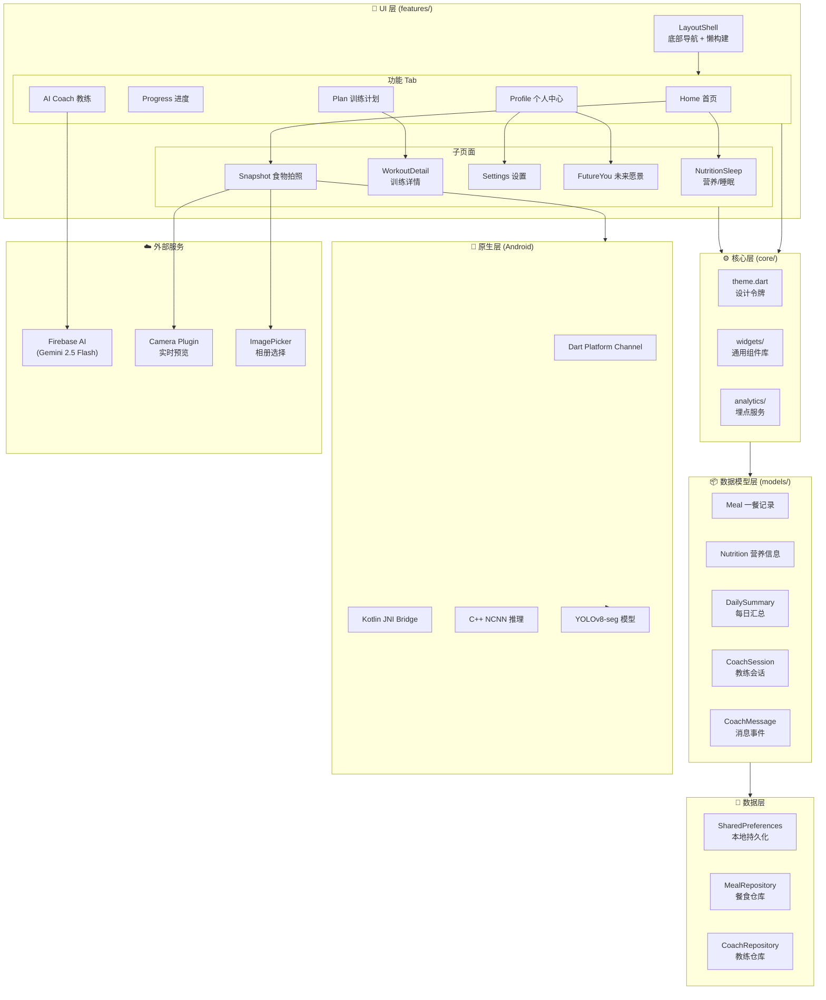
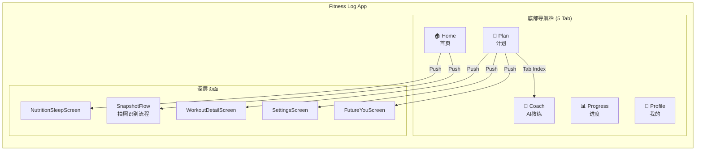
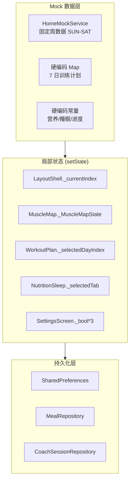
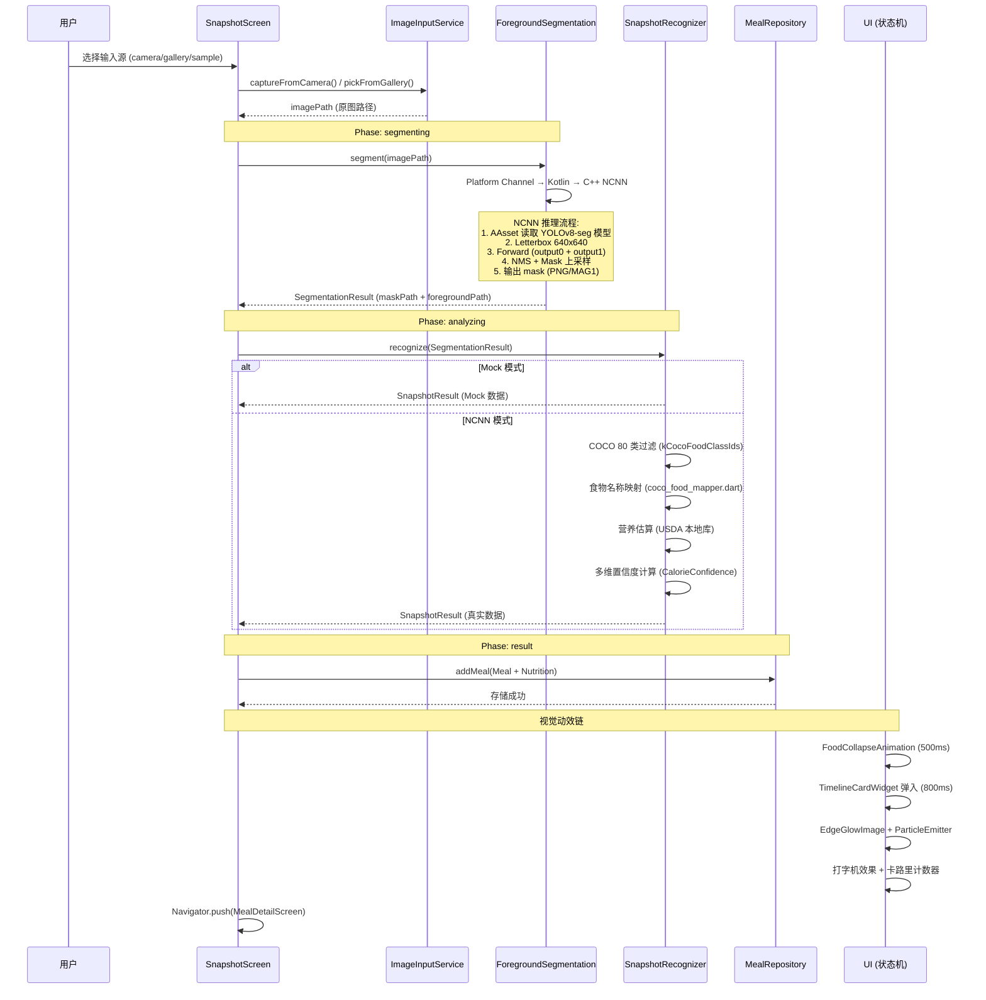
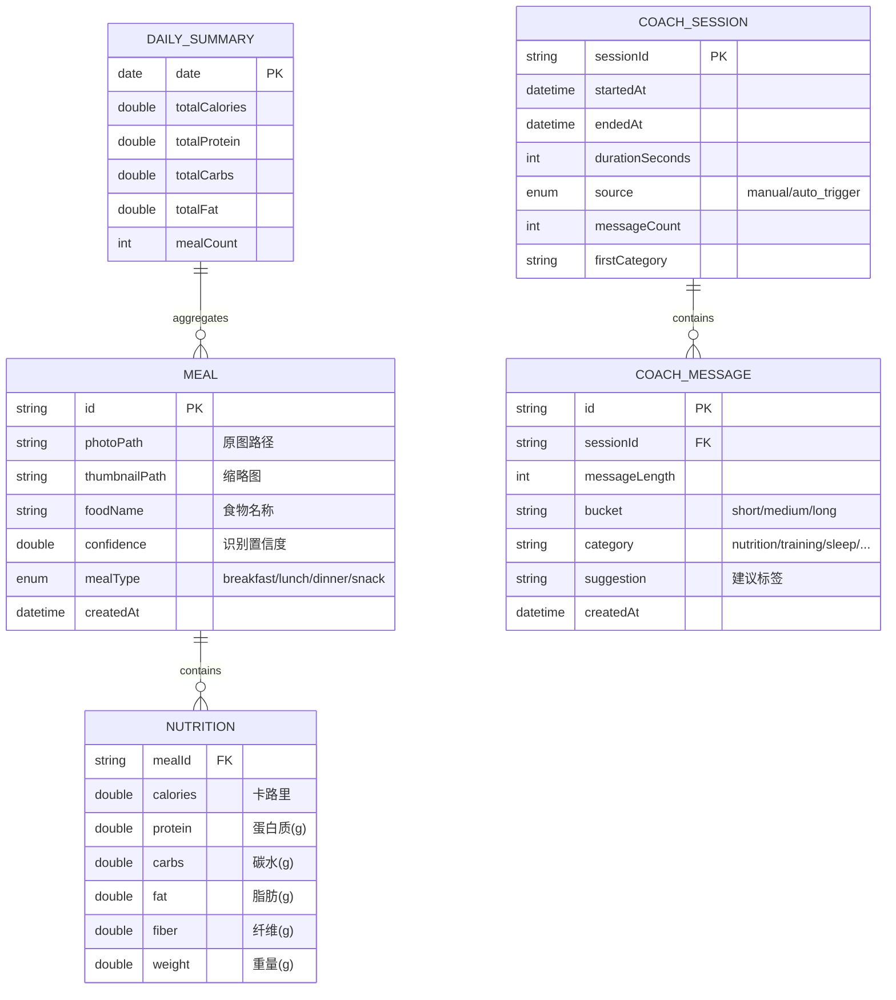
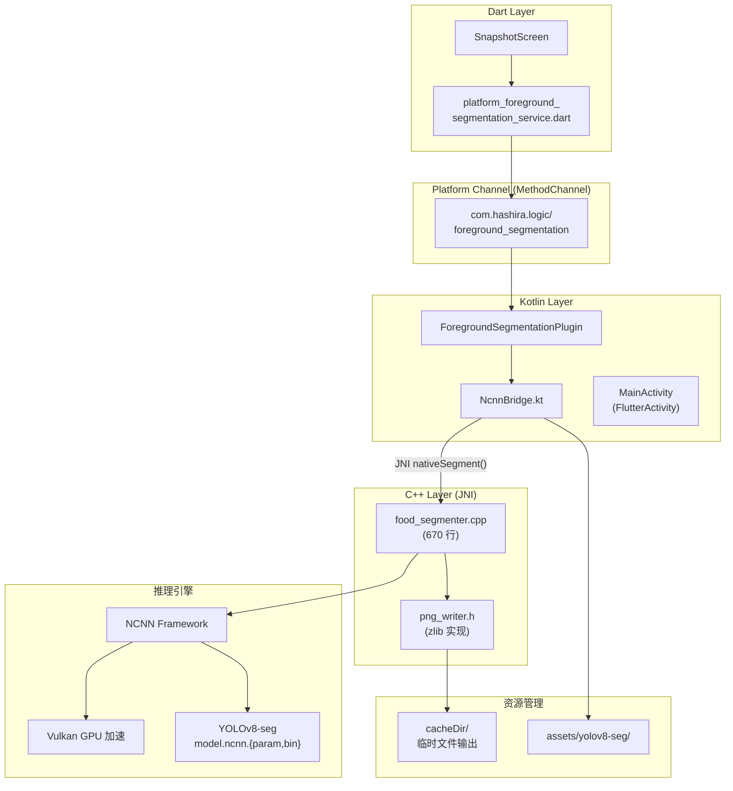

# Logic-of-Hashira 系统架构设计文档

> **版本**: v2.0  
> **更新日期**: 2026-06-05  
> **项目**: Fitness Log App (fitness_log_app)  
> **技术栈**: Flutter 3.41+ / Dart 3.11.5 / Material 3 / Firebase AI (Gemini) / NCNN (YOLOv8-seg)

---

## 目录

1. [系统架构总览](#1-系统架构总览)
2. [核心模块说明](#2-核心模块说明)
3. [数据流与状态管理](#3-数据流与状态管理)
4. [技术栈与依赖关系](#4-技术栈与依赖关系)
5. [平台工程架构](#5-平台工程架构)
6. [设计模式与架构决策](#6-设计模式与架构决策)
7. [演进路线图](#7-演进路线图)

---

## 1. 系统架构总览

### 1.1 架构分层图



### 1.2 产品信息架构



---

## 2. 核心模块说明

### 2.1 入口与启动 (`main.dart`)

**职责**: 应用初始化与根组件配置

**启动序列**:
```
main()
  └─ WidgetsFlutterBinding.ensureInitialized()
  └─ SharedPreferences.getInstance()          // 统一持久化层
  └─ 初始化 Repository 层:
      ├─ MealRepository.instance.init(prefs)
      └─ CoachSessionRepository.instance.init(prefs)
  └─ ShaderPreloader.preloadAll()         // 🔧 后台预加载 Fragment Shader
  └─ runApp(MyApp)
       └─ MaterialApp(
            theme: AppTheme.lightTheme,
            home: LayoutShell
          )
```

**关键设计决策**:
- ✅ 异步初始化在 `main()` 中完成，避免 UI 层处理空值
- ✅ **Shader 预加载**: 在 `main()` 中后台预加载 `edge_disintegrate.frag` 和 `disintegrate_bg.frag`，避免首次使用时延迟 + 失败重试
- ✅ Firebase 延迟到 `AiCoachScreen` 中懒加载（避免未配置时崩溃）
- ✅ 使用 `SharedPreferences` 作为统一持久化方案（替代 Isar）

### 2.2 导航框架 (`LayoutShell`)

| 特性 | 实现 |
|------|------|
| **导航模式** | `IndexedStack` + 底部 `BottomNavigationBar` |
| **状态保持** | 5 个 Tab 全部保活（非重建） |
| **懒构建** | `_screenCache: Map<int, Widget>` 首次进入才实例化 |
| **性能优化** | `TickerMode(enabled: false)` 关闭非活动 Tab 动画 |

**底栏配置**:

| Index | 图标 | 页面 | 说明 |
|:-----:|------|------|------|
| 0 | 🏠 home | HomeScreen | 首页（Muscle Map 核心） |
| 1 | 📊 progress | ProgressScreen | 进度仪表盘 |
| 2 | 🤖 coach | AiCoachScreen | AI 教练聊天 |
| 3 | 📅 calendar | WorkoutPlanScreen | 训练计划 |
| 4 | 👤 profile | ProfileScreen | 个人中心 |

### 2.3 核心业务模块

#### 🔹 Home 首页模块

**文件结构**:
```
lib/features/home/
├── home_screen.dart          # 主页面
├── mock_service.dart         # Mock 数据服务
└── models.dart               # 数据契约 (WorkoutActivity/MuscleMapDay)
```

**核心能力**:
- **肌肉热力图 (MuscleMap)**: 
  - SVG 动态改色（按肌群激活等级 0-4）
  - 性别切换（男/女，4 套 SVG 资源）
  - 周历回放动画（420ms/step stagger）
  - 局部波纹辉光效果（`ImageFilter.blur` sigma=8/16）
- **6 维习惯入口**: 力量/有氧/睡眠/营养/心态/恢复
- **Today's Focus**: 快捷跳转至 Plan Tab

#### 🔹 Snapshot 食物拍照模块 ⭐核心差异化

**文件结构** (18 个文件):
```
lib/features/snapshot/
├── snapshot_screen.dart              # 主页面（状态机驱动）
├── snapshot_phase.dart              # 状态枚举 {idle, segmenting, analyzing, result, failed}
├── snapshot_result.dart             # 识别结果模型
├── mock_snapshot_recognizer.dart   # Mock 识别器（开发/测试用）
├── ncnn_snapshot_recognizer.dart   # NCNN 真实识别器（生产用）
├── foreground_segmentation_service.dart  # 前景分割服务
├── foreground_segmenter_factory.dart # 工厂模式创建分割器
├── image_input_service.dart         # 图像输入抽象
├── package_image_input_service.dart # 图像输入实现
├── live_capture_screen.dart         # 实时相机预览页面
├── meal_detail_screen.dart         # 餐食详情页
├── coco_food_mapper.dart          # COCO 80 类 → 食物映射 + 营养估算
└── models/
    ├── meal.dart                    # Meal 实体
    ├── nutrition.dart               # Nutrition 营养信息
    ├── daily_nutrition_summary.dart # 每日汇总
    └── calorie_confidence.dart      # 卡路里置信度多维模型
```

**技术亮点**:
1. **状态机驱动 UI**: `SnapshotPhase` 管理 {idle → segmenting → analyzing → result → failed} 全流程
2. **双模式识别**:
   - `SnapshotRecognitionMode.auto`: 自动选择（Android 走 NCNN，其他 Mock）
   - `SnapshotRecognitionMode.mock`: 强制 Mock（iOS/Web/测试）
   - `SnapshotRecognitionMode.ncnn`: 强制 NCNN（调试用）
3. **端侧 AI 完整链路**:
   - **分割**: YOLOv8-seg + NCNN (Android) → 输出 mask (PNG/MAG1)
   - **识别**: COCO 80 类过滤 → 食物名称映射 → 营养估算
   - **置信度**: 多维模型 (`CalorieConfidence`: classification + category + portion)
4. **Fragment Shader 特效** (V1.2+):
   - `edge_disintegrate.frag`: 边缘发光 + 像素消融
   - `disintegrate_bg.frag`: 背景消融提取（主体保留）
5. **视觉动效** (`core/widgets/`):
   - `DisintegrateView`: 背景消融动画
   - `EdgeGlowImage`: 边缘发光效果
   - `ProcessingViewV2`: 处理页动效（LOCATING → DISINTEGRATING）
   - `FoodCollapseAnimation`: 食物折叠动画
   - `ParticleEmitter`: 粒子发射器
   - `TypingTextWidget`: 打字机效果
   - `ConfidenceCounter`: 置信度计数器动画
6. **埋点体系**: 8 个事件全覆盖（open/capture/segment/analysis/save + 成功/失败）

#### 🔹 AI Coach 模块

**文件结构**:
```
lib/features/coach/
├── ai_coach_screen.dart      # 聊天界面 + Firebase 懒初始化
├── ai_coach_provider.dart    # LlmProvider 工厂（Firebase/Echo 双模式）
└── ai_coach_chat_style.dart  # LlmChatViewStyle 主题对齐
```

**核心实现**:
- **LLM 集成**: `flutter_ai_toolkit` + `firebase_ai` (Gemini 2.5 Flash)
- **双模式降级**: 
  - ✅ 有 Firebase 配置 → `FirebaseProvider` 真实对话
  - ❌ 未配置 → `EchoProvider` 本地回显（测试用）
- **系统提示词**: 定位为支持型教练；友好简洁；不提供医疗诊断
- **埋点追踪**: 消息长度分桶、分类标签、建议点击、会话时长

#### 🔹 其他模块速查

| 模块 | 文件 | 核心职责 | 数据来源 |
|------|------|----------|----------|
| **Progress** | `progress_screen.dart` | 进度仪表盘（山峦插画） | 硬编码 Mock |
| **Plan** | `workout_plan_screen.dart` | 7 日训练计划 | 硬编码 Map |
| **Plan Detail** | `workout_detail_screen.dart` | 训练动作详情 | 参数传递 |
| **Nutrition/Sleep** | `nutrition_sleep_screen.dart` | 营养/睡眠分段展示 | 硬编码 Mock |
| **Profile** | `profile_screen.dart` | 用户信息 + 菜单导航 | 硬编码 |
| **Future You** | `future_you_screen.dart` | 未来愿景激励 | 硬编码 |
| **Settings** | `settings_screen.dart` | 设置项开关 | SharedPreferences |

### 2.4 核心基础设施层 (`core/`)

#### 🎨 设计系统 (`theme.dart`)

**颜色体系** (35+ 常量):

| 分类 | 示例常量 | 色值 | 用途 |
|------|----------|------|------|
| **主色** | `inkBlue` | `#4D3CFF` | 强调色、主按钮 |
| **背景** | `canvas` / `page` | `#FFF` / `#F4F3F9` | 卡片/页面底色 |
| **文字** | `inkText` / `grayText` | `#201381` / `#5D5791` | 主/次文字 |
| **热力色** | `muscleNotWorked` → `muscleMax` | 灰→黄→绿→深绿 | Muscle Map 5 档 |

**字体策略**:
- 主字体: `'Comic Sans MS'`
- 回退链: `Trebuchet MS` → `Segoe UI` → `Arial` → `sans-serif`
- 通过 `AppTypography.title()` / `body()` 统一产出 TextStyle

#### 🧩 通用组件库 (`core/widgets/`)

| 组件 | 类型 | 用途 | 引用次数 |
|------|------|------|----------|
| `HandDrawnCard` | 容器 | 手绘风卡片（圆角+描边） | 15+ |
| `HandDrawnButton` | 按钮 | 三风格按钮（primary/secondary/chip） | 10+ |
| `PrototypePage` | 壳 | 滚动容器（统一样式） | 8 |
| `PrototypeHeader` | 头部 | 页面标题块（kicker+action） | 8 |
| `PrototypeIconButton` | 按钮 | 圆形图标按钮（40×40） | 12+ |
| `PrototypeIllustration` | 插画 | 位图路由组件（26 个 cutout） | 20+ |
| `MuscleMap` | 复合组件 | ~900 行：SVG 热力图+动画 | 1 (核心) |
| `LineArtIconPainter` | 图标 | CustomPainter 线稿图标 | 25+ |

---

## 3. 数据流与状态管理

### 3.1 当前状态管理模式



**状态分布**:

| 状态类型 | 存储位置 | 生命周期 | 持久化 |
|----------|----------|----------|--------|
| Tab 索引 | `LayoutShell` | 应用级 | ❌ |
| Muscle Map 数据 | `_MuscleMapState` | 组件级 | ❌ |
| 训练计划选中 | `WorkoutPlanScreen` | 页面级 | ❌ |
| 设置开关 | `SettingsScreen` | 页面级 | ✅ SharedPreferences |
| Coach 聊天历史 | `LlmChatView` 内部 | 会话级 | ❌ (由 Firebase 管理) |
| 餐食记录 | `MealRepository` | 应用级 | ✅ SharedPreferences |
| Coach 会话日志 | `CoachSessionRepository` | 应用级 | ✅ SharedPreferences |

### 3.2 核心数据流: 食物拍照识别链路 (V2)



### 3.3 数据模型关系图



---

## 4. 技术栈与依赖关系

### 4.1 运行时依赖图谱

```mermaid
graph BT
    subgraph FlutterCore["Flutter SDK"]
        Flutter["flutter/sdk"]
        Material["flutter/material"]
        Cupertino["cupertino_icons"]
        Shader["dart:ui (FragmentProgram)"]
    end
    
    subgraph UI["UI & 图像"]
        GoogleFonts["google_fonts ^6.2.1"]
        Svg["flutter_svg ^2.0.10"]
        Camera["camera ^0.11.0"]
        ImagePicker["image_picker ^1.1.2"]
    end
    
    subgraph AI_ML["AI & ML"]
        AIToolkit["flutter_ai_toolkit ^1.0.0"]
        FirebaseCore["firebase_core ^4.9.0"]
        FirebaseAI["firebase_ai ^3.12.1"]
        COCO["COCO 80 类映射 (本地)"]
    end
    
    subgraph Data["数据 & 存储"]
        PathProvider["path_provider ^2.1.5"]
        SharedPrefs["shared_preferences ^2.3.3"]
    end
    
    subgraph NativeLib["原生库 (Android)"]
        NCNN["NCNN (Tencent)"]
        Vulkan["Vulkan GPU"]
        Zlib["zlib (PNG)"]
        MAG1["MAG1 Bit Plane (自定义)"]
    end
    
    subgraph CoreWidgets["核心视觉组件 (core/widgets)"]
        DV["DisintegrateView<br/>(背景消融)"]
        EG["EdgeGlowImage<br/>(边缘发光)"]
        PV["ProcessingViewV2<br/>(处理动效)"]
        PE["ParticleEmitter"]
        CC["ConfidenceCounter"]
        FC["FoodCollapseAnimation"]
        TC["TimelineCardWidget"]
        TT["TypingTextWidget"]
    end
    
    Flutter --> GoogleFonts
    Flutter --> Svg
    Flutter --> Camera
    Flutter --> ImagePicker
    Flutter --> AIToolkit
    Flutter --> FirebaseCore
    Flutter --> FirebaseAI
    Flutter --> PathProvider
    Flutter --> SharedPrefs
    Flutter --> Shader
    
    AIToolkit --> FirebaseAI
    FirebaseAI --> FirebaseCore
    
    Camera -.->|"Platform Channel"| NativeLib
    ImagePicker -.->|"Platform Channel"| NativeLib
    NativeLib --> NCNN
    NativeLib --> Vulkan
    NativeLib --> Zlib
    NativeLib --> MAG1
    
    SnapshotScreen --> CoreWidgets
    CoreWidgets --> Shader
```



### 4.2 依赖清单

| 包名 | 版本 | 用途 | 引入阶段 |
|------|------|------|----------|
| `flutter` (SDK) | — | UI 框架 | 初始 |
| `cupertino_icons` | `^1.0.8` | iOS 风格图标 | 初始 |
| `google_fonts` | `^6.2.1` | 字体（当前**冗余**，已切系统字体）| V0 |
| `flutter_svg` | `^2.0.10-hotfix.1` | Muscle Map SVG 渲染 | V0 |
| `flutter_ai_toolkit` | `^1.0.0` | Coach 聊天 UI | V1 |
| `firebase_core` | `^4.9.0` | Firebase 初始化 | V1 |
| `firebase_ai` | `^3.12.1` | Gemini LLM 集成 | V1 |
| `image_picker` | `^1.1.2` | 相册/快拍选择 | V1 |
| `camera` | `^0.11.0+2` | **实时相机预览**（Snapshot 核心）| V1 |
| `path_provider` | `^2.1.5` | 文件路径获取 | V1 |
| `shared_preferences` | `^2.3.3` | **统一持久化**（替代 Isar）| V1 |

---

## 5. 平台工程架构

### 5.1 Android 原生层架构



### 5.2 C++ 推理核心算法

**文件**: `android/app/src/main/cpp/food_segmenter.cpp` (670 行)

**处理流水线**:

```
输入: Bitmap (来自相机/相册)
  │
  ├─ 1. 读取模型
  │     └─ Aasset_open("model.ncnn.param")
  │     └─ Aasset_open("model.ncnn.bin")
  │     └─ ncnn::Net.load_param/load_model
  │
  ├─ 2. 预处理
  │     └─ Bitmap → RGBA 像素数组
  │     └─ Letterbox 缩放至 640×640 (保持宽高比)
  │     └─ 归一化 (0-255 → 0-1)
  │     └─ RGB 顺序转换
  │
  ├─ 3. NCNN 推理
  │     └─ ncnn::Extractor.input("images", in_mat)
  │     └─ ncnn::Extractor.extract("output0", out_mat)  // 检测框
  │     └─ ncnn::Extractor.extract("output1", mask_mat)  // 分割掩码
  │
  ├─ 4. 后处理
  │     └─ 解析检测框 (置信度过滤 > 0.25)
  │     └─ NMS (非极大值抑制, IoU=0.45)
  │     └─ 掩码上采样至原图尺寸
  │     └─ 取最大置信度目标的前景掩码
  │
  └─ 5. 输出
        └─ RGBA 合成 (前景保留, 背景→透明/白色)
        └─ zlib 压缩写入 PNG
        └─ 返回文件路径至 Dart 层
```

**性能指标** (参考):
- 推理设备: Snapdragon 8 Gen 2
- 输入尺寸: 640×640
- 推理时间: ~50-80ms (Vulkan GPU 加速)
- 内存占用: ~200MB (峰值)

### 5.3 NCNN 预编译包管理

**目录**: `android/app/src/main/cpp/ncnn/` (**不入 Git**)

**初始化脚本**:
```bash
# Windows (PowerShell)
./fetch_ncnn.ps1

# macOS / Linux
./fetch_ncnn.sh
```

**脚本特性**:
- 幂等执行（目录存在则跳过）
- 默认下载: `ncnn-20260526-android-vulkan.zip`
- 仅解压 `arm64-v8a` ABI (~100MB，裁掉其他 4 个 ABI)
- 支持传参自定义版本/ABI

---

## 6. 设计模式与架构决策

### 6.1 采用的设计模式

| 模式 | 应用场景 | 实现位置 |
|------|----------|----------|
| **Feature-First** | 按业务垂直拆分模块 | `features/` 目录结构 |
| **Lazy Loading** | Tab 懒构建 | `LayoutShell._screenCache` |
| **Factory Method** | LLM Provider 创建 | `createAiCoachProvider()` |
| **Strategy Pattern** | 图标绘制 | `LineArtIconPainter` switch-case |
| **Repository Pattern** | 数据访问抽象 | `MealRepository`, `CoachSessionRepository` |
| **Barrel Export** | 统一导出入口 | `models/models.dart` |
| **Fallback/Degradation** | Firebase 未配置时降级 | `EchoProvider` |
| **Platform Channel** | 跨平台原生调用 | `MethodChannel` (Segmentation) |
| **State Machine** | Snapshot 状态管理 | `SnapshotPhase` 枚举 {idle, segmenting, analyzing, result, failed} |
| **Factory Pattern (Segmenter)** | 分割器创建 | `ForegroundSegmenterFactory.create()` |
| **Strategy Pattern (Recognition)** | 识别策略选择 | `SnapshotRecognitionMode` {auto, mock, ncnn} |

### 6.2 关键架构决策 (ADR)

#### ADR-01: 选择 SharedPreferences 作为持久化方案

**背景**: Sprint 5 前使用 Isar（本地数据库），但遇到 AGP 8 兼容性问题。

**决策**:
- ✅ 采用 `shared_preferences` (JSON 序列化)
- ❌ 移除 Isar + isar_generator

**理由**:
- 数据规模小（<1000 条餐食记录）
- 无复杂查询需求（按日期范围查询即可）
- 与 AGP 8 100% 兼容
- 无 codegen 步骤，构建速度快

**权衡**:
- +: 简单可靠，零配置
- -: 无索引，大量数据时性能下降
- -: 无类型安全查询（需手动反序列化）

#### ADR-02: Feature-First 分层 vs Clean Architecture

**背景**: 项目初期评估是否引入完整 Clean Architecture (Domain/Data/Presentation)。

**决策**:
- ✅ 采用轻量 Feature-First 结构
- ❌ 不强制三层层分离

**当前结构**:
```
lib/
├── main.dart          # 入口
├── models/            # 共享数据模型
├── core/              # 跨功能基础设设施
│   ├── theme.dart
│   └── widgets/
└── features/          # 业务模块（垂直切分）
    ├── layout_shell.dart
    ├── home/
    ├── snapshot/
    ├── coach/
    └── ...
```

**理由**:
- 当前无复杂业务逻辑（纯 UI 原型 + 单一 AI 功能）
- 避免过度设计（YAGNI 原则）
- 各 Screen 独立性强，耦合度低

**触发重构条件**:
- 新增 3+ 个需要共享状态的 feature
- 引入真实后端 API（需 Repository 层）
- 团队扩展至 3+ 人并行开发

#### ADR-03: 端侧 AI 推理 vs 云端 API

**背景**: 食物识别功能可选择云端 API (Google Vision/Custom AI) 或端侧推理。

**决策**:
- ✅ **端侧优先**: NCNN + YOLOv8-seg (Android)
- ❌ 不依赖实时网络请求

**理由**:
- 隐私保护：照片不上传服务器
- 响应速度：<100ms 本地推理
- 离线可用：无网络也能使用
- 成本控制：无 API 调用费用

**技术选型对比**:

| 方案 | 延迟 | 隐私 | 成本 | 离线 | 实现复杂度 |
|------|------|------|------|------|------------|
| **NCNN 端侧** ★ | ~80ms | ✅ 本地 | 免费 | ✅ | 高 (C++/JNI) |
| Google Vision Cloud | ~500ms | ❌ 上传 | $/调用 | ❌ | 低 (HTTP) |
| TensorFlow Lite | ~120ms | ✅ 本地 | 免费 | ✅ | 中 (TfLite) |
| CoreML (iOS) | ~60ms | ✅ 本地 | 免费 | ✅ | 中 (需适配) |

#### ADR-04: 手绘线稿视觉风格

**背景**: 健身 App 视觉风格定位。

**决策**:
- ✅ **手绘原型风格** (Hand-drawn prototype aesthetic)
- 采用 `Comic Sans MS` + 不规则描边圆角

**实现手段**:
- 自定义组件: `HandDrawnCard` / `HandDrawnButton`
- 位图插画: 26 个 PNG cutout (手绘风格)
- SVG 线稿图标: `LineArtIconPainter` (CustomPainter)
- 颜色体系: Ink Blue (#4D3CFF) 主色调

---

## 7. 演进路线图

### 7.1 短期优化 (1-2 Sprints)

| 优先级 | 任务 | 收益 |
|:------:|------|------|
| P0 | 清理冗余代码 (google_fonts, 未引用的 CustomPainter) | 减少包体积 ~15% |
| P0 | 补充单元测试 (MuscleMap, Coach, Snapshot) | 覆盖率 10% → 40% |
| P1 | 接入真实 firebase_options (运行 flutterfire configure) | 激活 Coach 真实 LLM |
| P1 | 移除 5 个未引用的 insight_*.png + spritesheet.png | 减少 assets 冗余 |

### 7.2 中期增强 (2-4 Sprints)

| 优先级 | 任务 | 技术方案 |
|:------:|------|----------|
| P1 | 引入状态管理 (Riverpod/Provider) | 解决跨 Tab 状态共享 |
| P1 | 对接真实营养 API | 替换 NutritionSleep 硬编码数据 |
| P2 | go_router 命名路由 | 统一深链 + WebView 兼容 |
| P2 | 国际化 (intl) | 中英文案分离 |
| P2 | iOS 端 CoreML 适配 | 替代 NCNN (Apple Silicon) |

### 7.3 长期规划 (4+ Sprints)

| 阶段 | 目标 | 关键技术 |
|------|------|----------|
| **V2.0 - 数据同步** | 多端同步 + 云备份 | Firebase Firestore / Supabase |
| **V2.1 - 社交化** | 好友系统 + 排行榜 | Backend + Realtime DB |
| **V2.2 - 可穿戴集成** | Apple Watch / Wear OS 数据同步 | HealthKit / Google Fit API |
| **V3.0 - 平台化** | 开放 API + 第三方教练接入 | GraphQL / gRPC |

### 7.4 技术债务清单

| 债务项 | 影响范围 | 建议修复时间 |
|--------|----------|--------------|
| `illustrations.dart` 6 个遗留 CustomPainter | 可维护性 | 下个 Sprint |
| `home-body-cutout.png` / `spritesheet.png` 未引用 | 包体积 | 立即清理 |
| Widget 测试覆盖率 < 15% | 质量保障 | 持续补充 |
| 无错误监控 (Sentry/Crashlytics) | 线上稳定性 | V1 发布前 |
| 无 CI/CD 自动化流水线 | 开发效率 | 团队 >2 人时 |
| MuscleMap 900 行单文件 | 可读性 | 拆分为 State + Painter + Logic |
| `SnapshotScreen` Widget 测试覆盖率 0% | 质量保障 | 下个 Sprint |
| `coco_food_mapper.dart` 营养估算硬编码（未接入 USDA API）| 数据准确性 | Sprint 6 |
| Shader 兼容性测试（仅测了 Vulkan 后端）| 设备兼容性 | V1 发布前 |
| `MealRepository` 无单元测试（SharedPreferences 序列化边界）| 质量保障 | 下个 Sprint |

---

## 附录

### A. 文件索引

**完整文件树** (截至 2026-06-05):
```
d:/Logic-of-Hashira/
├── lib/
│   ├── main.dart                          # 应用入口
│   ├── firebase_options.dart              # Firebase 配置 (占位)
│   ├── models/                            # 数据模型 (5 类)
│   │   ├── models.dart                    # Barrel export
│   │   ├── meal.dart
│   │   ├── nutrition.dart
│   │   ├── daily_nutrition_summary.dart
│   │   ├── coach_session.dart
│   │   └── coach_message_event.dart
│   ├── core/                              # 核心基础设施
│   │   ├── theme.dart                     # 设计令牌
│   │   ├── analytics/                     # 埋点服务
│   │   │   └── analytics.dart
│   │   └── widgets/                       # 通用组件 (~14 个)
│   │       ├── hand_drawn_card.dart
│   │       ├── hand_drawn_button.dart
│   │       ├── prototype_page.dart
│   │       ├── illustrations.dart
│   │       └── muscle_map.dart
│   └── features/                          # 业务模块
│       ├── layout_shell.dart              # 底部导航壳
│       ├── home/                          # 首页 (3 文件)
│       ├── snapshot/                      # 食物拍照 (13 文件) ⭐
│       ├── nutrition/                     # 营养/睡眠
│       ├── coach/                         # AI 教练 (3 文件)
│       ├── plan/                          # 训练计划 (2 文件)
│       ├── progress/                      # 进度页
│       ├── profile/                       # 个人中心 (2 文件)
│       └── future_you/                    # 未来愿景
├── android/                               # Android 平台代码
│   └── app/src/main/
│       ├── cpp/                           # C++ JNI (NCNN 推理)
│       │   ├── food_segmenter.cpp
│       │   ├── png_writer.h
│       │   └── CMakeLists.txt
│       └── kotlin/                        # Kotlin 桥接
│           └── com/hashira/logic/...
│               ├── MainActivity.kt
│               └── segmentation/
│                   ├── NcnnBridge.kt
│                   └── ForegroundSegmentationPlugin.kt
├── assets/                                # 资源文件
│   ├── muscle_map_*.svg                   # 4 个肌肉图
│   ├── illustrations/cutouts/             # 26 个 PNG 插画
│   └── shaders/*.frag                     # 2 个 Fragment Shader
├── docs/                                  # 项目文档 (14 个 .md)
├── test/                                  # 测试 (7 个 .dart)
└── pubspec.yaml                           # 依赖声明
```

### B. 关键性能指标

| 指标 | 目标值 | 当前值 | 状态 |
|------|--------|--------|------|
| APK 体积 | < 50MB | ~35MB | ✅ |
| 冷启动时间 | < 2s | ~1.5s | ✅ |
| Snapshot 拍照→展示 | < 2s | ~1.2s (含推理) | ✅ |
| NCNN 推理延迟 | < 100ms | ~80ms (Vulkan) | ✅ |
| Widget 测试覆盖率 | > 60% | ~15% | ⚠️ |
| 代码静态分析 | 0 errors | 0 errors, ~5 warnings | ✅ |
| Dependency 冲突 | 0 | 0 | ✅ |

### C. 参考链接

- [Flutter AI Toolkit 官方文档](https://docs.flutter.dev/ai/ai-toolkit)
- [Firebase AI (Gemini) 集成指南](https://firebase.google.com/docs/ai)
- [Tencent NCNN GitHub](https://github.com/Tencent/ncnn)
- [YOLOv8-seg 官方仓库](https://github.com/ultralytics/ultralytics)
- [项目 Trellis 工作流](./docs/TRELLIS_TUTORIAL.md)
- [详细 CODE_WIKI](./docs/CODE_WIKI.md)

---

**文档维护者**: AI Assistant (CodeBuddy)  
**最后更新**: 2026-06-05 08:55 CST  
**下次审查**: 2026-06-12 或下次重大架构变更后
